+++
title = "Applications of NASA's Black Marble Nighttime Lights Product Suite"
date = 2025-05-15T07:18:52-04:00
math = true
+++

This post will showcase some applications of one of NASA's most well-known satellite products: the Black Marble nightlights suite. This set of remotely sensed products allows us to observe how the Earth looks at night, with countless applications in areas such as disaster response, economic activity monitoring, energy infrastructure tracking, and more. Let’s dive in!

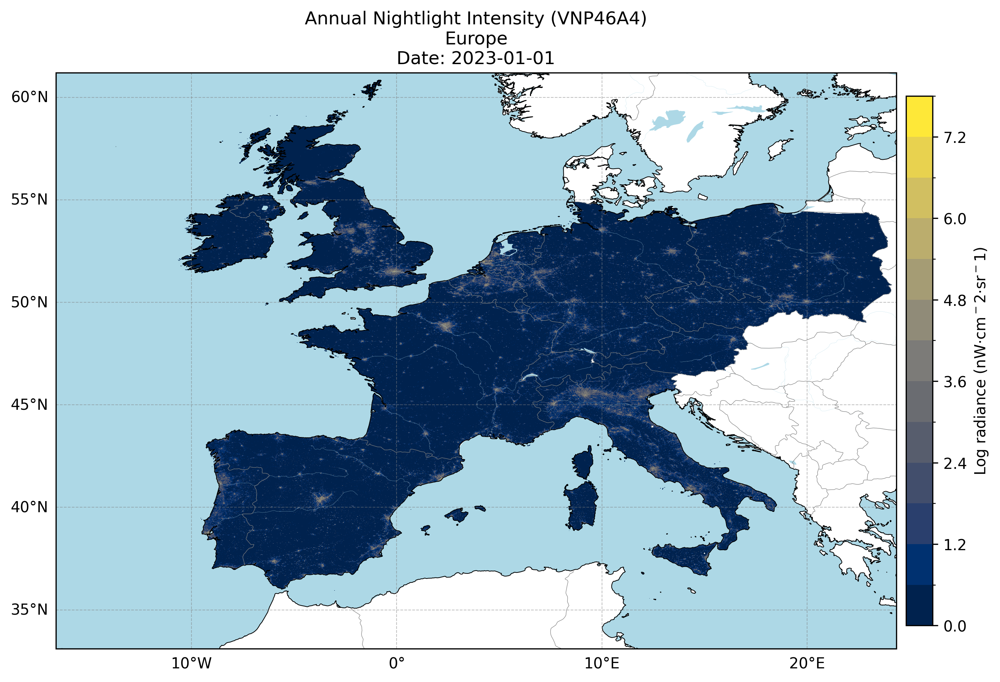

Figure 1: Nighttime Lights Over Europe, 2023.

## Product Overview

The NASA's Black Marble product suite provides insights into nighttime lights around the globe. Available from January 2012 until the present day and with a spatial resolution of 15 arc second (~500 meters), these products are derived from data collected by the Visible Infrared Imaging Radiometer Suite (VIIRS) Day/Night Band instrument on the Suomi National Polar-orbiting Partnership (NPP) satellite.

At the core of the Black Marble suite are two primary products: VNP46A1 and VNP46A2. VNP46A1 is a daily, top-of-atmosphere product that captures raw nighttime radiance data without any corrections applied. VNP46A2, on the other hand, is a daily moonlight- and atmosphere-corrected Nighttime Lights product. It undergoes various corrections including cloud removal, atmospheric correction lunar bidirectional reflectance distribution function (BRDF) adjustment, and snow/vegetation effects mitigation.

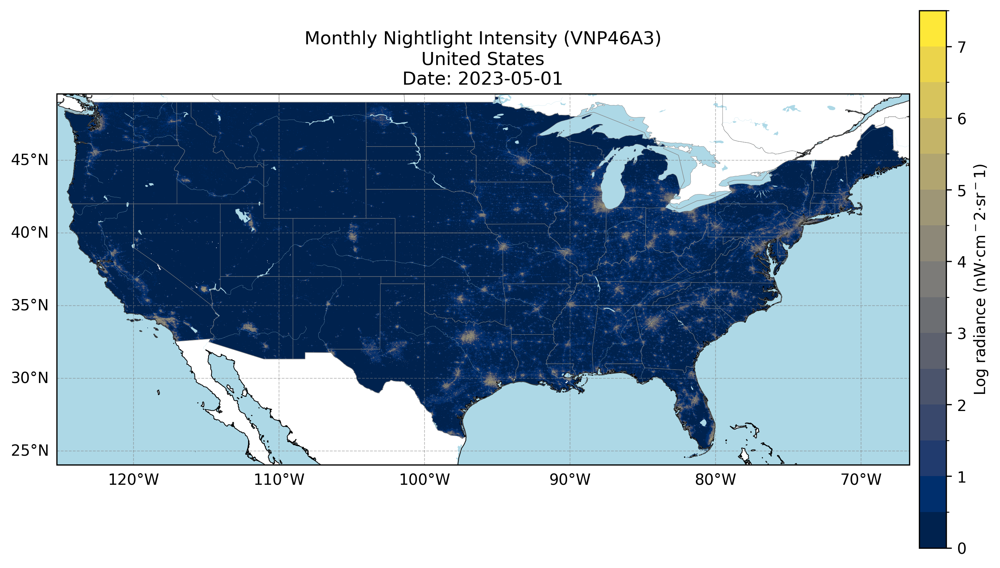

Figure 2: Nighttime Lights Over Mainland United States, May 2023.

The VNP46A3 and VNP46A4 products are generated from the VNP46A2 daily VIIRS Day/Night Band (DNB) radiance data by compositing high-quality, cloud-free nighttime observations. A key step in this process is the application of a boxplot-based correction that uses the interquartile range (IQR) to identify and remove outliers. Specifically, observations falling outside the range defined by Q1 − 1.5×IQR and Q3 + 1.5×IQR are considered anomalous and excluded, effectively filtering out spurious light sources such as fires, lightning, or flaring. The cleaned data is then aggregated to produce stable monthly (VNP46A3) and annual (VNP46A4) composites that better represent persistent nighttime lights. 

For more information, check out the [Black Marble User Guide](https://ladsweb.modaps.eosdis.nasa.gov/api/v2/content/archives/Document%20Archive/Science%20Data%20Product%20Documentation/Black-Marble_v2.0_UG_2024.pdf).

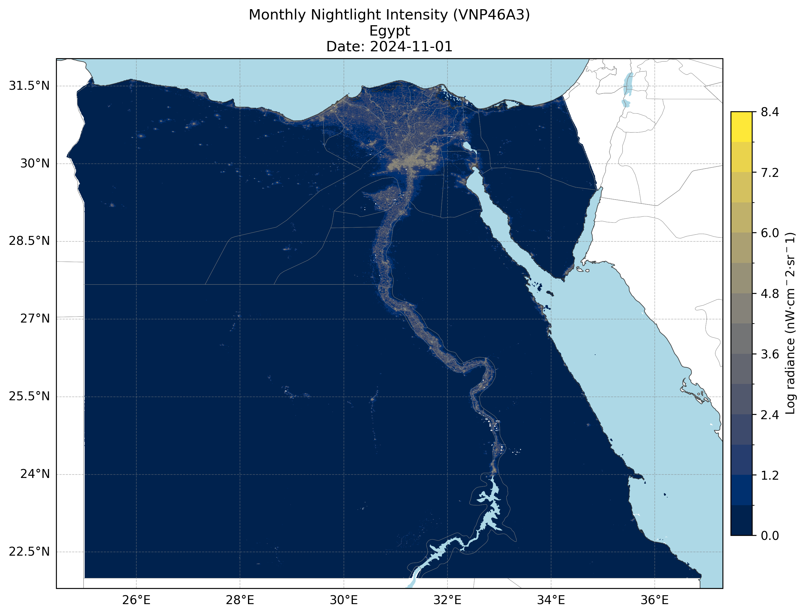

Figure 3: Nighttime Lights Over Egypt, November 2023.

# Applied Uses of Nighttime Light Data

The Black Marble suite has been used in various applications, including mapping economic development patterns, assessing conflict-associated changes, and aiding in disaster response efforts, such as monitoring power outages during hurricanes and tracking recovery efforts post-disaster.

## Economic Development

Nighttime lights have historically been used to estimate economic development using remote sensing data. Their use can be applied at subnational boundaries or in places where official data quality is poor.

### The Korean Peninsula

The image of the Korean Peninsula at night illustrates the stark contrast in development between North Korea and South Korea. While South Korea is brightly illuminated with clusters of lights indicating widespread urbanization, industrial activity, and infrastructure, North Korea remains almost completely dark except for a faint glow around Pyongyang.

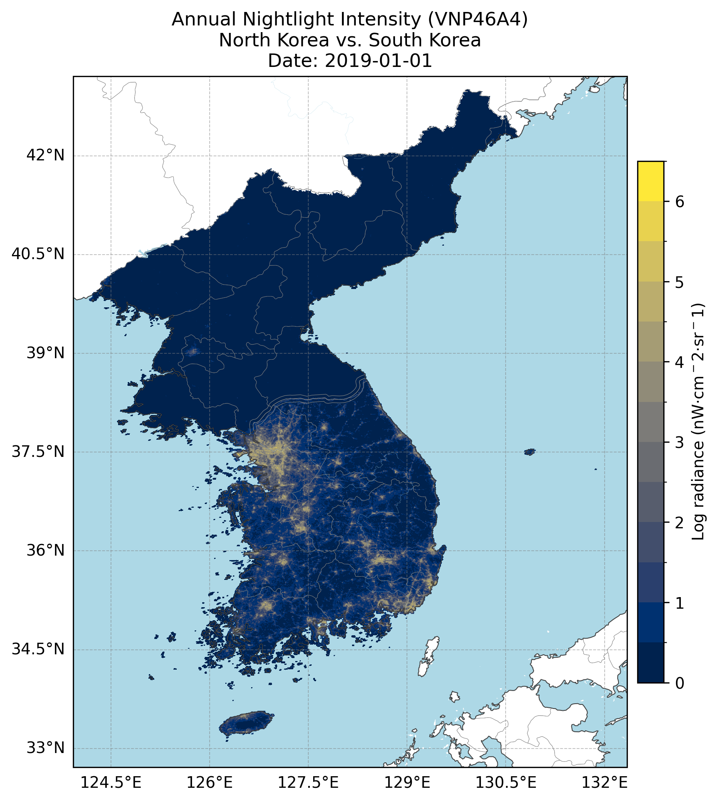

Figure 4: Nighttime lights reveal the development gap between bright South Korea and mostly dark North Korea.

### Rural To Urban Transition In Delhi And Haryana

The 2012–2023 nighttime imagery shows growing urban connectivity west of Delhi, with once-isolated towns in Haryana now forming a continuous band of lights. This expansion highlights increased infrastructure and urban sprawl, transforming the region into an integrated urban corridor.

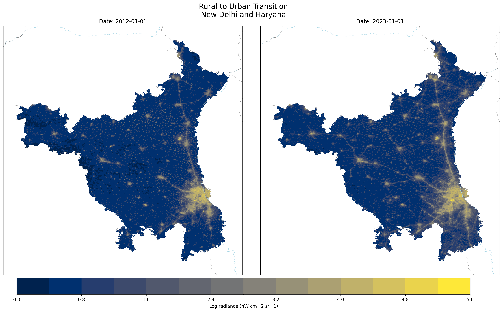

Figure 5: Urban growth west of Delhi shows increasing connectivity and expansion in Haryana from 2012 to 2023.

## Natural Disaster Impacts

Natural disasters often cause damage to infrastructure, leading to significant disruptions in power supply. Satellite-based nighttime light data offers a way to visually track the scale and duration of these impacts, as well as the recovery process.

#### Puerto Rico Blackout After Hurricane María

The next timelapse depicts the impact of Hurricane María on Puerto Rico between June 1 and November 1, 2017, through changes in nighttime lights. Before the hurricane, the island shows widespread illumination, indicating normal power availability. As María strikes in September 2017, there is a big drop in brightness across the island, reflecting power outages caused by the storm’s destruction. Gradually, over the following weeks, the lights begin to recover, illustrating the slow but steady restoration of electricity and infrastructure.

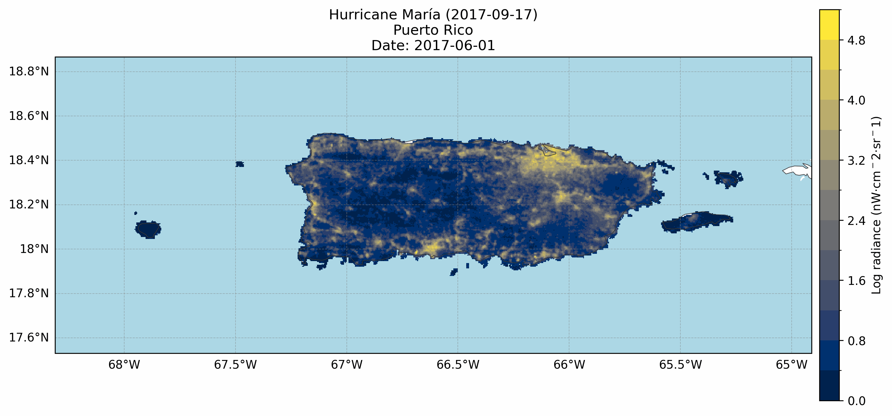

Figure 6: Nighttime lights over Puerto Rico from June to November 2017 show the severe power outages caused by Hurricane María and the gradual recovery afterward.

## Conflict-Associated Changes

Armed conflicts often lead to significant disruptions in infrastructure, population displacement, and economic activity. Monitoring changes in nighttime lights provides a powerful tool to detect and quantify these impacts remotely, especially in areas where on-the-ground data is limited or unavailable.

### Russian Attacks On Kyiv's Energy Infrastructure

The next timelapse depicting Kyiv City and Kyiv Oblast from November 2021 to May 2022 illustrates stable nighttime light levels until February 2022, when the Russo-Ukrainian conflict escalated. That month, [reported attacks targeted Kyiv’s energy infrastructure](https://www.reuters.com/article/ukraine-crisis-kyiv-hydro-idUKS0N2S1022/), leading to widespread power outages clearly visible as a sharp drop in illumination across the city. The accompanying line plot quantifies this change, showing a significant decline in both the mean and median nighttime light values starting February 2022, marked by a vertical line indicating the conflict’s onset.

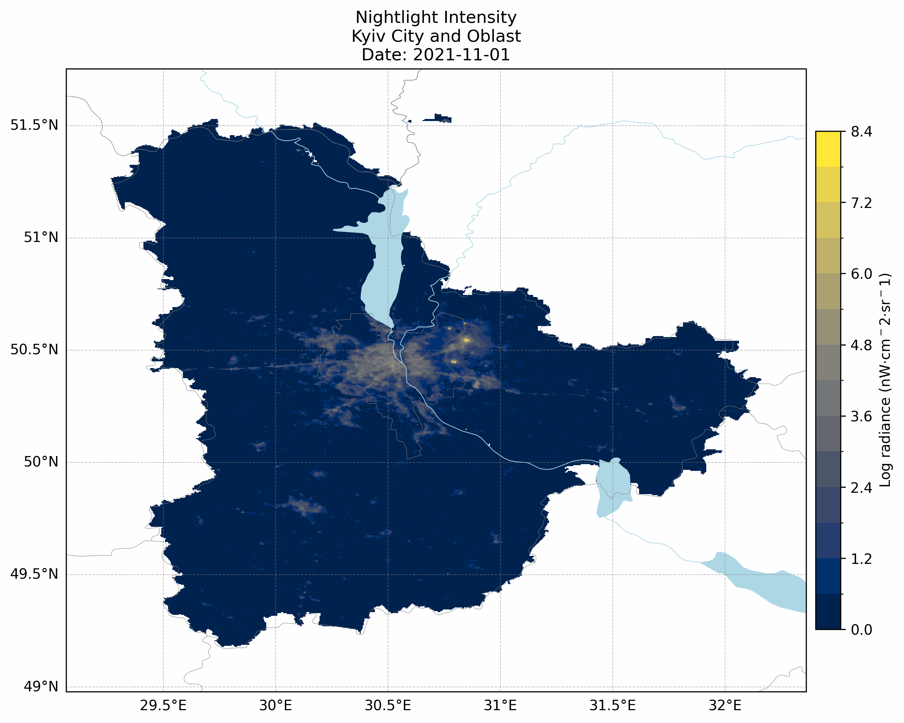

Figure 7: Nighttime lights over Kyiv City and Kyiv Oblast from November 2021 to May 2022, showing stable illumination until outages occur following conflict escalation in February 2022.

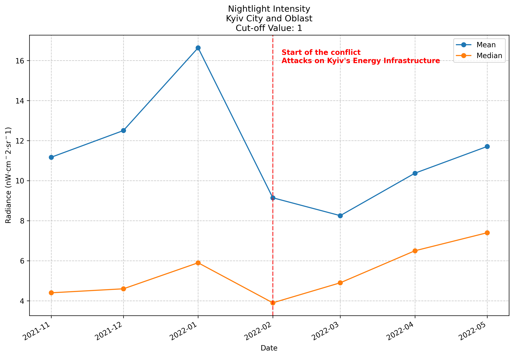

Figure 8: Mean and median nighttime light intensity for Kyiv City and Kyiv Oblast from November 2021 to May 2022, with a vertical line marking the start of the conflict and a clear decline in lights thereafter.

### Sudan's Armed Conflict Hits Al Khartum

The timelapse showing Al Khartoum’s nighttime lights from early 2023 highlights a decline in illumination starting April 2023, coinciding with the escalation of the Sudan conflict and the resulting displacement crisis. This decrease reflects power outages and population movement away from the city. The accompanying line plot tracks the mean and median nighttime light values over the same period, clearly illustrating the drop beginning in April 2023.

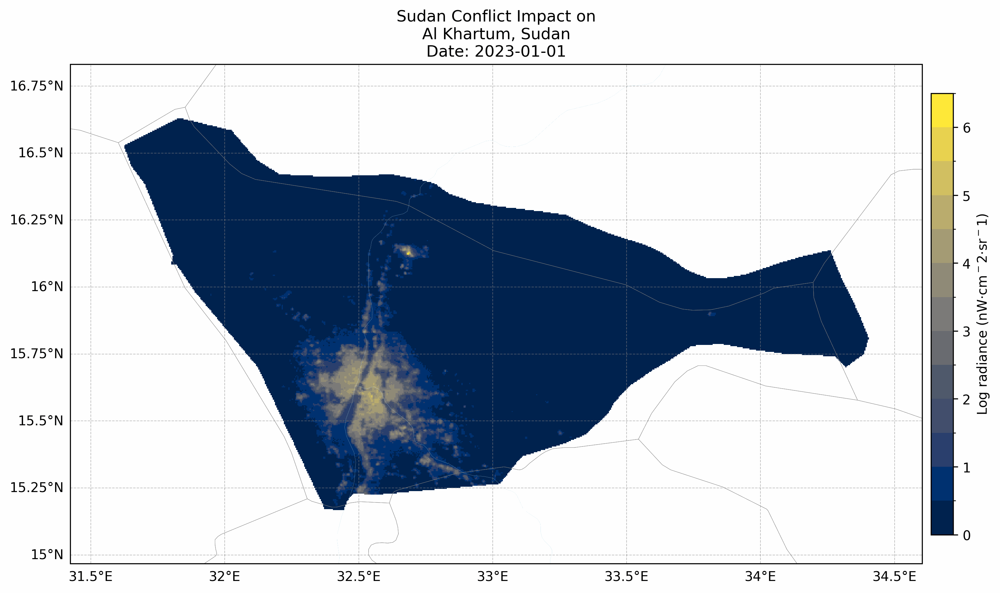

Figure 9: Nighttime lights over Al Khartoum in early 2023, showing a decline in illumination following the Sudan conflict escalation and displacement crisis in April 2023.

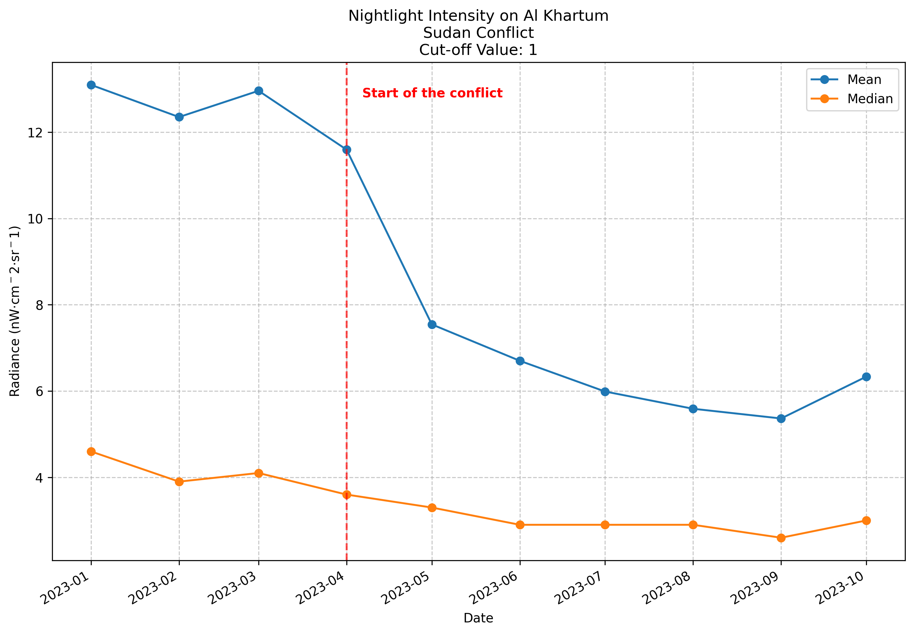

Figure 10: Mean and median nighttime light intensity in Al Khartoum from early 2023, with a drop starting April 2023, corresponding to the onset of conflict-related disruptions.

# Gallery

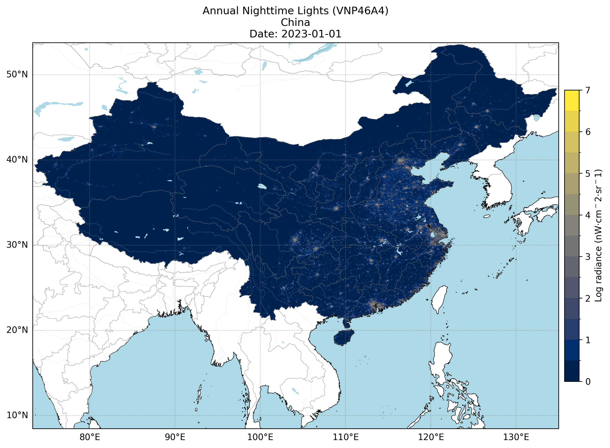

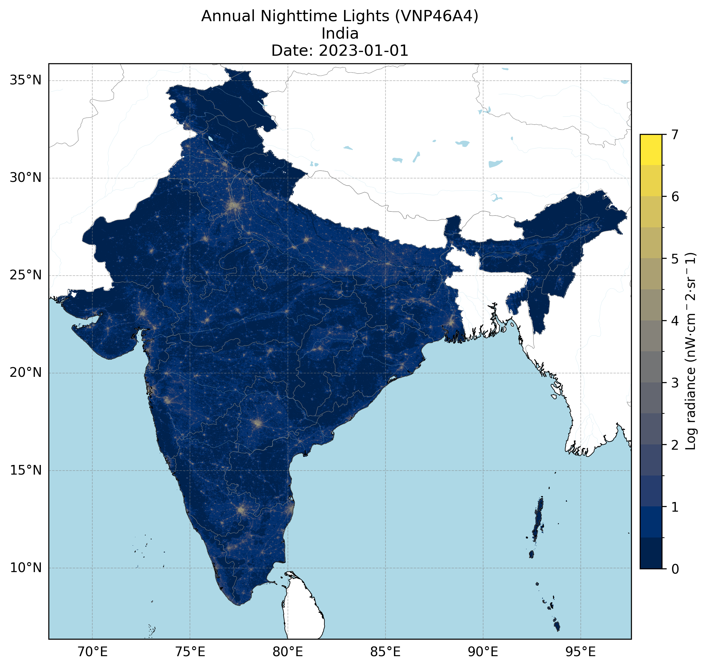

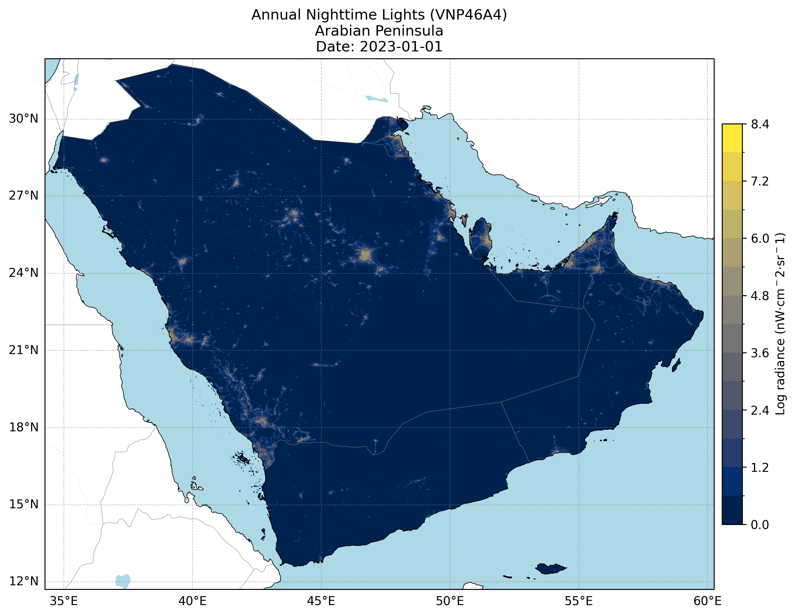

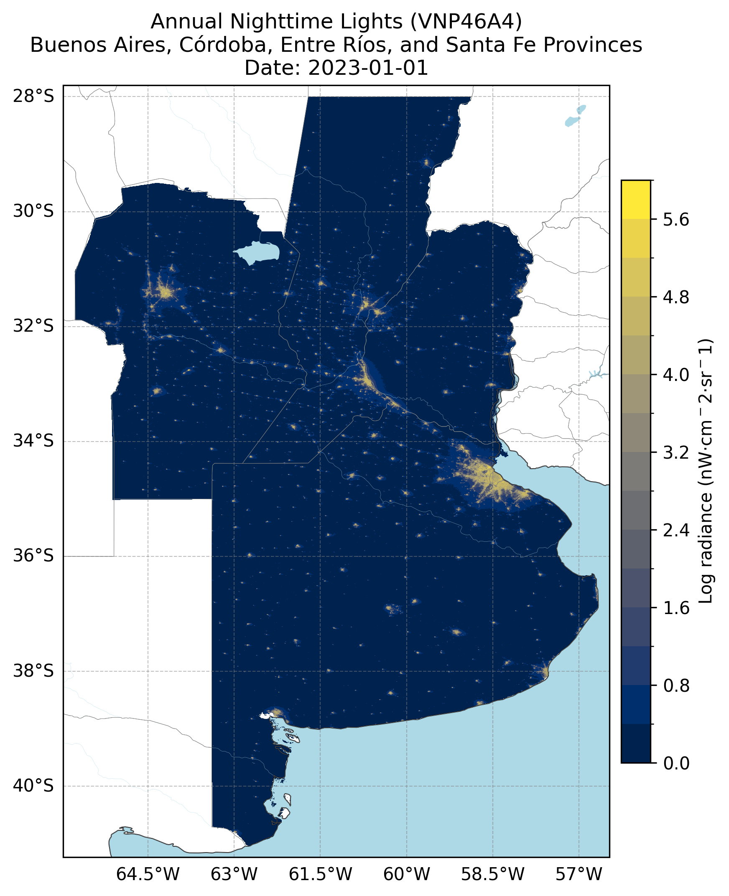

## Conclusion

That's it for this post! All the images, visualizations, and timelapses in this post were created using a custom Python toolkit I developed called [nightlights](https://github.com/jeronimoluza/nightlights). The project simplifies downloading, processing, and visualizing NASA’s Black Marble Nighttime Lights data (VIIRS), making it easier to explore changes in illumination over time. It supports a wide range of use cases—from urbanization analysis to disaster response—and includes features for creating maps, line plots, side-by-side comparisons, and GIF animations. The code is open source and available on GitHub. Check it out [here](https://github.com/jeronimoluza/nightlights)!
