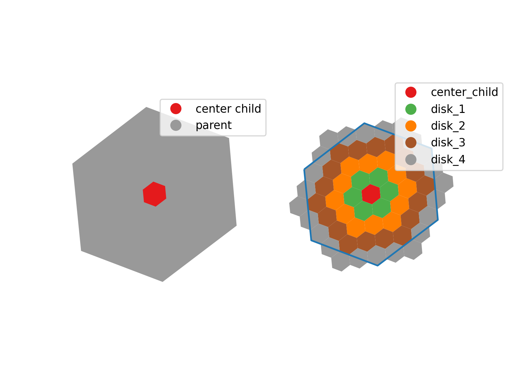
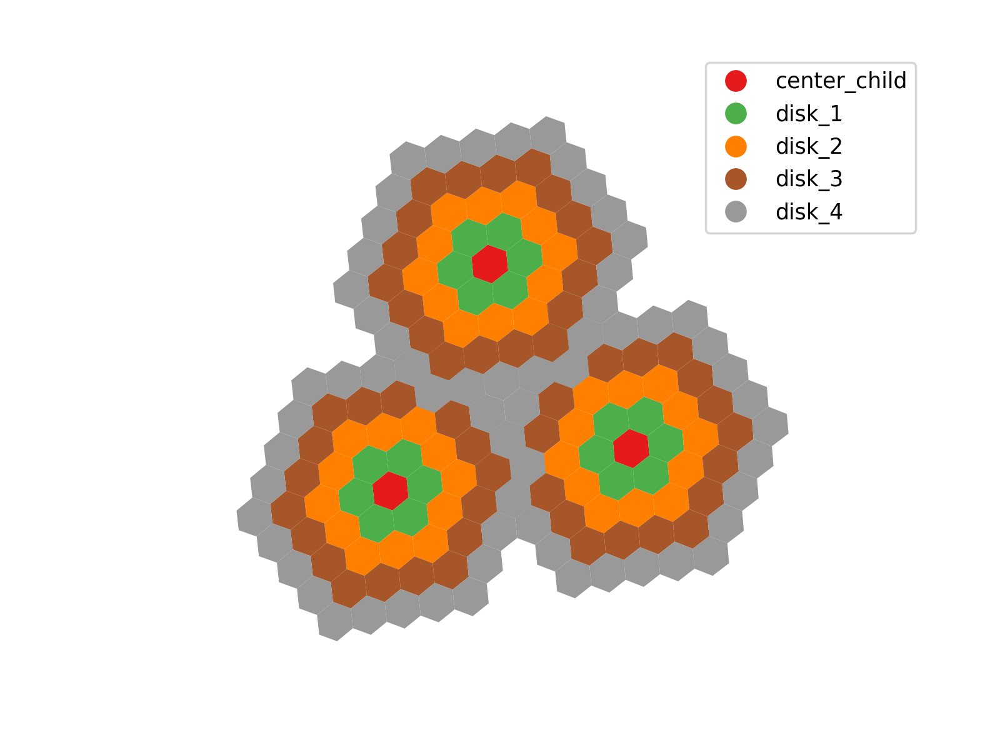

+++
title = 'Bypassing AWS Athena "Query Exhausted Resources" When Performing Geospatial Operations'
date = 2024-10-17T16:25:52-04:00
+++

## The Problem

If you work with Amazon Web Services (AWS) Athena SQL, chances are that you've encountered the following error:

`Query exhausted resources at this scale factor`

This generally indicates that you are hitting memory limits on the Athena cluster that runs your query ([reference 1](https://repost.aws/questions/QU5M0ASE-_R_mvSMXDWrnuDA/athena-version-3-error-query-exhausted-resources-at-this-scale-factor), [reference 2](https://repost.aws/questions/QUdYYEXbb0QMuKX6TwDl17GA/athena-query-exhausted-resources-at-this-scale-factor), [reference 3](https://repost.aws/knowledge-center/athena-query-exhausted)). AWS provides several [performance optimization strategies](https://docs.aws.amazon.com/athena/latest/ug/performance-tuning.html), including [data optimization](https://docs.aws.amazon.com/athena/latest/ug/performance-tuning-data-optimization-techniques.html), [query optimization](https://docs.aws.amazon.com/athena/latest/ug/performance-tuning-query-optimization-techniques.html), and [data partitioning](https://docs.aws.amazon.com/athena/latest/ug/partition-projection.html#partition-projection-using).

This error can often be the result of a cartesian product when performing spatial operations involving a large number of geometries on both sides of the tables being joined. Athena attempts to process every single geometry from the left table with every geometry from the right table, leading to an exponential increase in the number of comparisons. This can overwhelm Athena’s processing capabilities, causing the engine to "choke" on the amount of data being processed and ultimately resulting in the exhausted resources error.

## The Proposed Solution

To avoid this, it is essential to introduce intermediate steps before reaching the final desired result. Instead of performing a direct intersection between all geometries at once, segmenting the operations using progressively larger geometries can significantly reduce the cartesian product.

For example, if we want to intersect roads with census tract data for an entire continent, the direct cartesian product between all roads and all census tracts would be computationally overwhelming. Instead, we can introduce intermediate steps:

- First, intersect the roads with country geometries.

- Then, intersect the resulting roads with province/state geometries.

- Next, intersect the resulting roads with municipality geometries.

- Finally, intersect the resulting roads with the census tract geometries inside those municipalities.

By structuring the operation into these intermediate steps and storing intermediate results in temporary tables, we can refine the spatial joins at finer levels of detail. This segmentation prevents Athena from processing an excessive number of comparisons at once, allowing the query to run within memory constraints.

## The Implementation

To illustrate the previous example, we will start by assuming that we have a roads dataset (`roads`) with the next structure:

| road_id | linestring |
|---------|----------------------|
| R1      | LINESTRING((...))    |
| R2      | LINESTRING((...))    |
| R3      | LINESTRING((...))    |
| R4      | LINESTRING((...))    |
| R5      | LINESTRING((...))    |

To perform these intermediate steps, we will need a mapped Athena table for every connecting step. Since spatial relationships of the administrative boundaries are hierarchical, we utilize Athena tables to establish connections between different geographic levels.

A table connecting countries with provinces/states (`countries_provinces`):

| country_id | country_geometry | province_id | province_geometry |
|------------|----------------|--------------------|-------------------------|
| A          | POLYGON((...)) | A1                 | POLYGON((...))          |
| A          | POLYGON((...)) | A2                 | POLYGON((...))          |
| B          | POLYGON((...)) | B1                 | POLYGON((...))          |
| B          | POLYGON((...)) | B2                 | POLYGON((...))          |
| C          | POLYGON((...)) | C1                 | POLYGON((...))          |


A table connecting provinces/states with municipalities (`provinces_munips`):

| province_id | province_geometry| munip_id | munip_geometry |
|-------------------|------------------------|-----------------|-----------------------|
| A1               | POLYGON((...))          | A1M1            | POLYGON((...))        |
| A1               | POLYGON((...))          | A1M2            | POLYGON((...))        |
| A2               | POLYGON((...))          | A2M1            | POLYGON((...))        |
| B1               | POLYGON((...))          | B1M1            | POLYGON((...))        |
| C1               | POLYGON((...))          | C1M1            | POLYGON((...))        |

A table connecting municipalities with census tracts (`munips_tracts`):

| munip_id | munip_geometry | tract_id | tract_geometry |
|----------------|----------------------|----------------|----------------------|
| A1M1          | POLYGON((...))       | A1M1T1         | POLYGON((...))       |
| A1M1          | POLYGON((...))       | A1M1T2         | POLYGON((...))       |
| A1M2          | POLYGON((...))       | A1M2T1         | POLYGON((...))       |
| B1M1          | POLYGON((...))       | B1M1T1         | POLYGON((...))       |
| C1M1          | POLYGON((...))       | C1M1T1         | POLYGON((...))       |


Then, using SQL queries, we can specify temporary tables using `WITH` clauses in the following way:

```SQL
WITH step1 as (
  SELECT
    road_id,
    country_id,
    province_id,
    linestring
  FROM
    roads
  INNER JOIN
    country_provinces
  ON
    st_intersects(
      st_line(roads.linestring),
      st_geometryfromtext(country_provinces.country_geometry)
    )
  AND
    st_intersects(
      st_line(linestring),
      st_geometryfromtext(country_provinces.province_geometry)
    )
),

WITH step2 as (
  SELECT
    road_id,
    province_id,
    munip_id,
    linestring
  FROM
    step1
  INNER JOIN
    provinces_munips
  ON
    step1.province_id = provinces_munips.province_id
  AND
    st_intersects(
      st_line(step1.linestring),
      st_geometryfromtext(provinces_munip.province_geometry)
    )
  AND
    st_intersects(
      st_line(step1.linestring),
      st_geometryfromtext(provinces_munips.munip_geometry)
    )
)

SELECT 
  road_id,
  tract_id,
  st_intersection(
    st_geometryfromtext(step3.linestring),
    st_geometryfromtext(step3.tract_geometry)
  ) linestring
FROM
  step2
INNER JOIN
  munips_tracts
ON
  step2.munip_id = munips_tracts.munip_id
AND
  st_intersects(
    st_line(step2.linestring),
    st_geometryfromtext(munips_tracts.munip_geometry)
    )
AND
  st_intersects(
    st_line(step2.linestring),
    st_geometryfromtext(munips_tracts.tract_geometry)
  )
WHERE
  st_geometrytype(
    st_intersection(
      st_polygon(munip_tracts.tract_geometry),
      st_line(step2.linestring)
  )
  ) <> 'ST_Point'
```

This query breaks down the process of matching roads to different geographic areas step by step. First, it finds which roads intersect both a country and a province, making sure each road is linked to the right region. Then, it narrows things down by matching those roads to the municipalities inside each province.  

In the final step, the query connects roads to census tracts, checking which roads cross into each smaller area. It also makes sure the intersection is meaningful by filtering out cases where only a single point touches the boundary. This step-by-step approach keeps the process organized and prevents the system from handling too much data at once.

## Using H3 Hexagons

H3 hexagons make it easier to break down spatial intersections step by step by organizing geographic areas into a hierarchy. Instead of checking every small hexagon right away, we start with larger hexagons that cover broader regions. If a road or feature intersects one of these parent hexagons, we then check only its child hexagons at the next resolution level. This way, we reduce the number of calculations needed at each step, making the process faster and preventing memory issues in Athena.

The disk methods in H3 enable efficient hierarchical linking by expanding each hexagon to include its surrounding neighbors, providing spatial continuity across resolution levels. By using these methods, we can construct a database where each coarse hexagon is pre-associated with the finer-resolution hexagons that fall within its extent.



This structured approach is especially useful for large-scale spatial processing, where direct intersections across an entire high-resolution grid would be computationally prohibitive. By storing hierarchical relationships in separate tables, each step refines the analysis to a smaller subset of hexagons, reducing the number of comparisons at each level. This ensures that queries remain efficient, even when dealing with vast geographic areas, allowing large-scale geospatial operations to be performed in a controlled and scalable manner.


