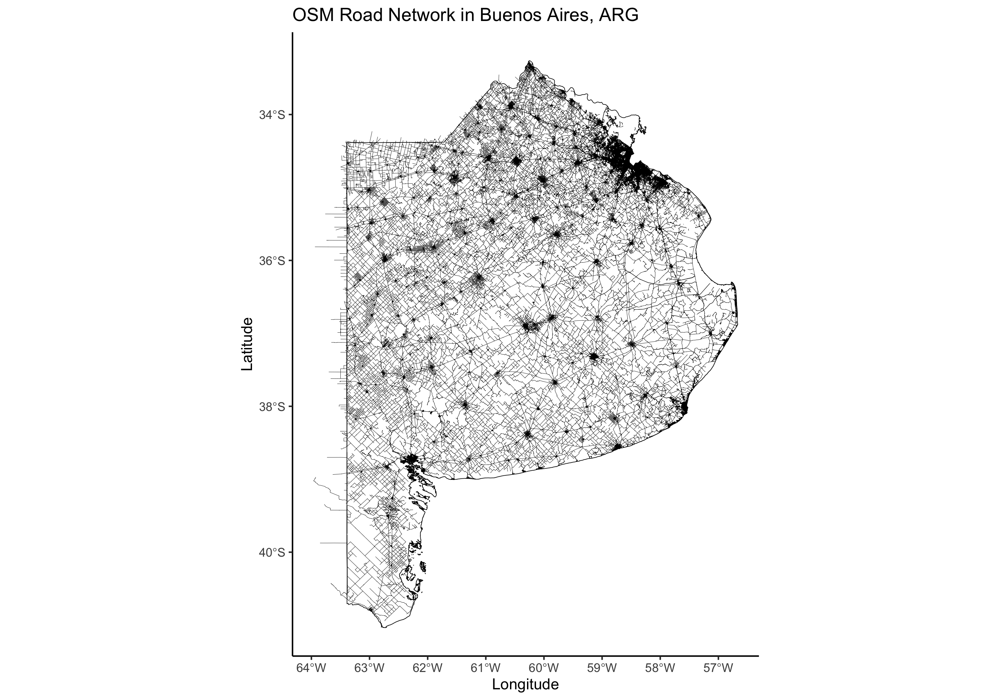
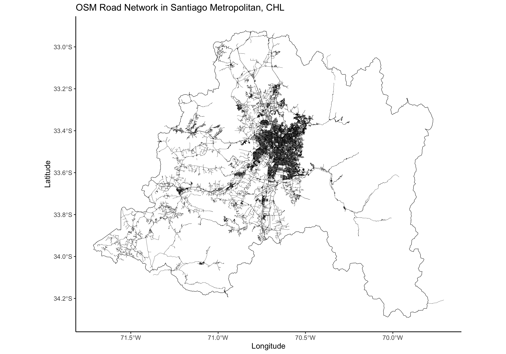
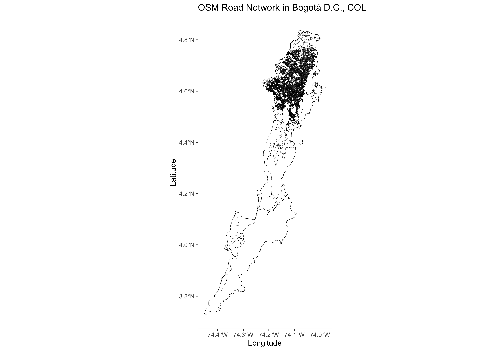
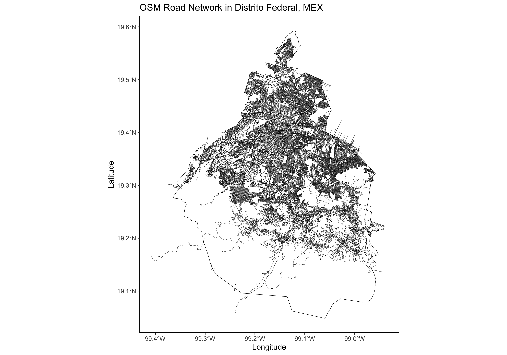
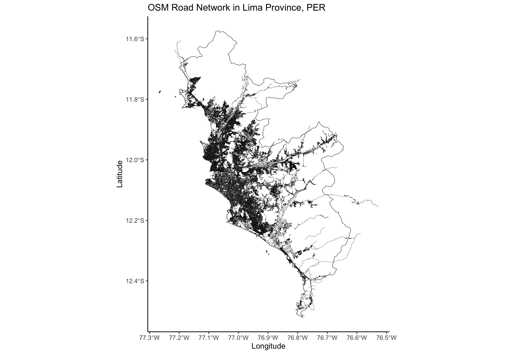

+++
title = 'Extract Road Network Data for Administrative Regions With R'
date = 2025-01-17T16:25:52-04:00
+++



One of the most common data requests in geospatial data science is obtaining the road network within a given administrative boundary. This includes identifying road locations, classifying road types, and calculating the total road length within a region—an essential analysis for various applications.

OpenStreetMap (OSM) is widely recognized as the go-to source for road network data, thanks to its crowdsourced contributions that provide global coverage. To step outside my usual Python development, I decided to create an R function to extract OSM road network data for a given administrative boundary. This function generates a CSV containing the roads' linestrings within the boundary and, if requested, also exports a PNG visualizing the results.

```r
get_osm_highways <- function(country_iso3, level = 0, name_level1 = NULL, plot = FALSE) {
...
}
```

First, we need to install and load the necessary R libraries to support the data extraction and processing workflow:

```r
install.packages(c("osmdata","geodata","sf","ggplot2","dplyr"))

library(osmdata)
library(geodata)
library(sf)
library(ggplot2)
library(dplyr)
```

The function begins by setting up the necessary output directories. It creates a `csv` folder to store the exported road linestring data and a `png` folder for saving plotted visualizations if requested.

```r
dir.create("csv", showWarnings = FALSE)
dir.create("png", showWarnings = FALSE)
```

With the `geodata` package, we retrieve administrative boundary data from the Database of Global Administrative Areas ([GADM](https://gadm.org/)) for our selected region. [`geodata`](https://cran.r-project.org/web/packages/geodata/index.html) provides functions for downloading geographic data, streamlining spatial analysis and mapping. It offers access to a wide range of datasets, including climate, land use, elevation, soil, species occurrence, accessibility, and administrative boundaries.

```r
gadm_data <- gadm(country = country_iso3, level = level, path = "./data")
```

To ensure valid region selection, we implement a validation step. If the specified region does not exist, the function lists all available level 1 regions for the chosen country. Once a valid region is selected, it is filtered from the rest of the data. If no level 1 region is provided, the function defaults to using the entire country as the area of interest.

```r
# Check if Level 1 name exists
if (!is.null(name_level1) && !(name_level1 %in% unique(gadm_data$name_1))) {
  stop(paste("there is no", name_level1, "at level 1. available names are:\n", 
            paste(unique(gadm_data$name_1), collapse = ", ")))
}

# If level1 name is provided, filter the region
if (!is.null(name_level1)) {
  region <- gadm_data[gadm_data$name_1 == name_level1, ]
} else {
  region <- gadm_data  # use whole country if no specific region is provided
  }
```

To interact with the `osmdata` library, we first process our region data. We convert the filtered region into an `sf` object, a standardized format for encoding spatial vector data. Since `osmdata` requires a bounding box to filter raw OSM data, we then extract the region’s bounding box using the `st_bbox()` function.

```r
# Convert region to sf object
region_sf <- st_as_sf(region)

# Get bounding box for OSM query
region_bbox <- st_bbox(region_sf)
```


With the bounding box defined, we use the `osmdata` package to retrieve features within our area of interest that contain the `highway` key and specific road types. For descriptions of these road categories, refer to the [OSM Wiki](https://wiki.openstreetmap.org/). After extracting the road network as line features, we refine the results by filtering only the roads that intersect with the original administrative boundary, rather than the broader bounding box.

```r
# Query OSM for highways within the bounding box
osm_data <- opq(bbox = region_bbox) %>%
  add_osm_feature(key = "highway", 
                  value = c("motorway", "motorway_link", "primary", "primary_link", 
                            "residential", "secondary", "secondary_link", 
                            "tertiary", "tertiary_link", "trunk", "trunk_link", 
                            "unclassified")) %>%
  osmdata_sf()

# Extract highway lines
osm_lines <- osm_data$osm_lines

# Filter only features that intersect with the selected region
osm_filtered <- osm_lines[st_intersects(osm_lines, region_sf, sparse = FALSE), ]
```

In the final step, we structure the dataset to include the road type, geometry in Well-Known Text (WKT) format, and segment length in meters. We achieve this using the `mutate()` and `select()` functions from the `dplyr` package, ensuring a clean and well-formatted output.

```r
# Convert geometry to WKT and compute lengths
osm_filtered <- osm_filtered %>%
  mutate(wkt_geometry = st_as_text(geometry),
        length_m = st_length(geometry)) %>%
  select(highway, wkt_geometry, length_m)
```

Finally, we export the output dataset as CSV, and export the PNG of the plot produced in `ggplot2`.

```r
# Save to CSV
csv_filename <- paste0("csv/", country_iso3, "_highways.csv")
write.csv(osm_filtered, csv_filename, row.names = FALSE)
message("CSV saved to: ", csv_filename)

# Plot and save PNG if requested
if (plot) {
  plot_filename <- paste0("png/", country_iso3, "_highways.png")
  
  ggplot() +
    geom_sf(data = region_sf, fill = NA, color = "black", size = 0.5) +  # Region boundary
    geom_sf(data = osm_filtered, color = "blue", size = 0.4) +  # OSM highways
    labs(title = paste("OSM Road Network in", country_iso3),
          x = "Longitude", y = "Latitude") +
    theme_minimal()
  ggsave(filename = plot_filename, width = 10, height = 7)
  
  message("Plot saved to: ", plot_filename)
}
```

You can find the complete script on [my GitHub repo](https://github.com/jeronimoluza/code_samples).

If you get an error that says `Error: Overpass query unavailable without internet`, just paste the next line at the beginning of the script:

```r
assign("has_internet_via_proxy", TRUE, environment(curl::has_internet))
```

### Captures





