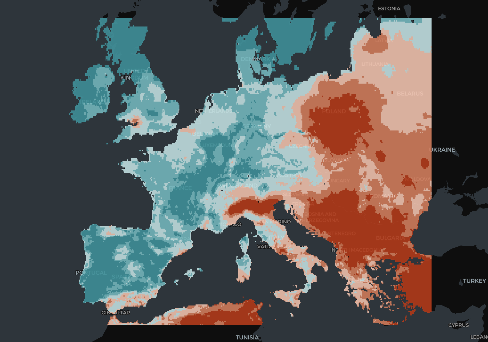
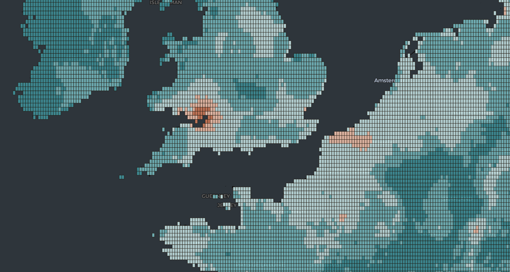
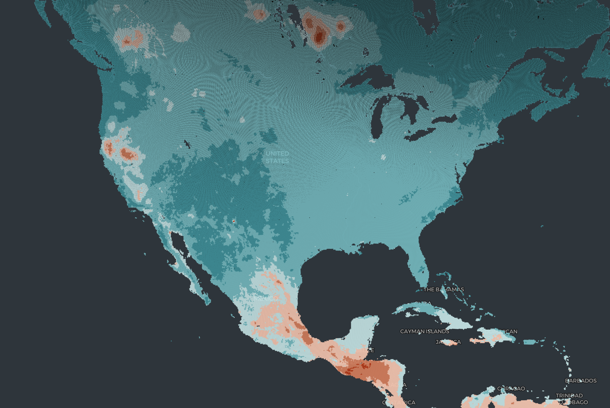

+++
title = 'Extract PM2.5 Pixels and Convert Them to H3 Hexagons'
date = 2024-09-18T20:45:52-04:00
+++

A few months ago I had the opportunity to work with the PM2.5 data provided by the Washington University in St. Louis.

The initiative comprises a collection of estimated global and regional annual and monthly satellite-derived ground-level fine particulate matter (PM2.5) gridded datasets ([Shen et al., 2024](https://pubs.acs.org/doi/full/10.1021/acsestair.3c00054)), spanning the years 1998 to 2022. This collection combines Aerosol Optical Depth (AOD) retrievals from NASA MODIS, MISR, and SeaWIFS, and is available at resolutions 0.01º x 0.01º and 0.1º x 0.1º. For more details and downloading information, visit [Satellite-derived PM2.5](https://sites.wustl.edu/acag/datasets/surface-pm2-5/).

This article will showcase some Python code I used to extract the information from this data to generate vector geometries from the gridded pixels and transform them to H3 hexagons for easier visualization and anaylsis. For simplicity's sake, this demonstration will be done using the global annual composite at the lower resolution (0.1° × 0.1°), but the same process can be applied to the rest of the datasets.

```python
import xarray as xa
file = 'V5GL03.HybridPM25c_0p10.Global.202101-202112.nc'
ds = xa.open_dataset(file)
ds
```

The data has various levels of processing and it is already gridded. The file provides the length of the sides of the pixels in degrees, which we can use to form the grid geometries from the pixel centroids.

```text
<xarray.Dataset> Size: 18MB
Dimensions:  (lon: 3600, lat: 1230)
Coordinates:
  * lon      (lon) float64 29kB -179.9 -179.8 -179.8 ... 179.8 179.9 179.9
  * lat      (lat) float64 10kB -54.95 -54.85 -54.75 ... 67.75 67.85 67.95
Data variables:
    GWRPM25  (lat, lon) float32 18MB ...
Attributes:
    Title:            Hybrid PM_2_._5 [\mug/m^3]
    Contact:          Aaron van Donkelaar <aaron.vandonkelaar@wustl.edu>
    References:       van Donkelaar et al., Monthly Global Estimates of Fine ...
    Filename:         C:\Users\Aaron\Documents\MATLAB\PM25_wMelanie\GlobalMon...
    Format:           NetCDF-4
    Delta_Lat:        0.10000228881835938
    Delta_Lon:        0.0999908447265625
    SpatialCoverage:  Global
    Start_Date:       20210101
    End_Date:         20211231
```

```python
print('Pixel Longitude Side:', ds.Delta_Lon)
print('Pixel Latitude Side:', ds.Delta_Lat)
```

```text
Pixel Longitude Side in Degrees: 0.0999908447265625
Pixel Latitude Side in Degrees: 0.10000228881835938
```

Converting the multidimensional array file into a `pandas` dataframe, we get:

```python
data = ds.to_dataframe().reset_index();
```

```text
|   |    lon |   lat |   GWRPM25 |
|--:|-------:|------:|----------:|
| 0 | 179.95 | 67.55 |       2.3 |
| 1 | 179.95 | 67.65 |       2.3 |
| 2 | 179.95 | 67.75 |       2.4 |
| 3 | 179.95 | 67.85 |       2.3 |
| 4 | 179.95 | 67.95 |       2.2 |
```

Don't forget to close the `xarray.Dataset` object by doing `ds.close()`.

Then, using a function that calculates the corner points of each pixel based on its centroid latitude (`lat`) and longitude (`lon`) points and the length of the pixel's sides in degrees, we generate a vector geometry using `shapely.Polygon`.

```python
def get_bounding_coordinates(lat, lon, delta_lat, delta_lon):
    half_side_lat = delta_lat / 2
    half_side_lon = delta_lon / 2

    point0 = (lon - half_side_lon, lat - half_side_lat)
    point1 = (lon + half_side_lon, lat - half_side_lat)
    point2 = (lon + half_side_lon, lat + half_side_lat)
    point3 = (lon - half_side_lon, lat + half_side_lat)

    return Polygon([point0, point1, point2, point3])
```

You can find a more detailed explanation of what this function does in [this notebook]().

If we apply this function to every row in our dataframe, we will generate the next output:

```
|   GWRPM25 | geometry                                                                                                                                                                                                       |
|----------:|:---------------------------------------------------------------------------------------------------------------------------------------------------------------------------------------------------------------|
|       7.1 | POLYGON ((-10.599992752075195 51.99999809265137, -10.500001907348633 51.99999809265137, -10.500001907348633 52.10000038146973, -10.599992752075195 52.10000038146973, -10.599992752075195 51.99999809265137))  |
|       7   | POLYGON ((-10.499992370605469 52.09999656677246, -10.400001525878906 52.09999656677246, -10.400001525878906 52.19999885559082, -10.499992370605469 52.19999885559082, -10.499992370605469 52.09999656677246))  |
|       7.1 | POLYGON ((-10.399991989135742 51.799997329711914, -10.30000114440918 51.799997329711914, -10.30000114440918 51.89999961853027, -10.399991989135742 51.89999961853027, -10.399991989135742 51.799997329711914)) |
|       7.1 | POLYGON ((-10.399991989135742 51.89999961853027, -10.30000114440918 51.89999961853027, -10.30000114440918 52.00000190734863, -10.399991989135742 52.00000190734863, -10.399991989135742 51.89999961853027))    |
|       7.6 | POLYGON ((-10.399991989135742 52.09999656677246, -10.30000114440918 52.09999656677246, -10.30000114440918 52.19999885559082, -10.399991989135742 52.19999885559082, -10.399991989135742 52.09999656677246))    |
```

We can use [kepler.gl](https://kepler.gl/demo) to visualize the extracted polygons:


_Subset of pixels over Europe_

_Closer look at pixels over UK_

Finally, we can convert the pixels to H3 hexagons by using the `h3` Python library:

```python
def h3_polyfill(geometry, resolution):
	coords = [(lat, lon) for lon, lat in geometry.exterior.coords]
	return h3.polygon_to_cells(h3.Polygon(coords), resolution)
```

Passing the previous function to all the geometries in our data, we can generate the next output that we can also visualize in [kepler.gl](https://kepler.gl/demo):

```
| hex             |   pm2.5 |
|:----------------|--------:|
| 8618011b7ffffff |     7.1 |
| 861801187ffffff |     7.1 |
| 861801c47ffffff |     7   |
| 861801007ffffff |     7.1 |
| 86180101fffffff |     7.1 |
```


_Hexagons over United Kingdom_


_Hexagons over Latin America_


_Hexagons over North America_


_Hexagons over Asia & Africa_

You can find all the code I used [in this repository](). There's also a script you can use to execute this process over a large number of files.

## References

Shen, S., Li, C., Van Donkelaar, A., Jacobs, N., Wang, C., & Martin, R. V. (2024). Enhancing global estimation of fine particulate matter concentrations by including geophysical a priori information in deep learning. _ACS ES&T Air_, _1_(5), 332–345. https://doi.org/10.1021/acsestair.3c00054
