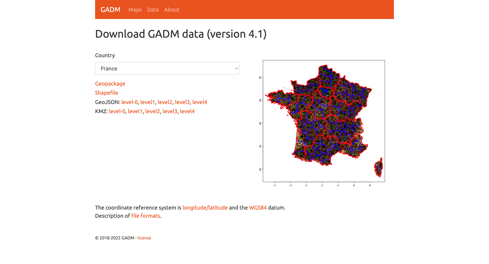

+++
title = 'geoterminal is out!'
date = 2025-04-10T00:25:52-04:00
+++


How many times did you have to open QGIS, ArcGIS, or a Python terminal just to convert a shapefile to a GeoJSON? Shouldn't be easier for GIS (Geographic Information Systems) people to grab a georreferenced file, apply a buffer of X amount of meters or apply a clip, reproject it, and export it to a different file format? Do we have to open a full desktop application or develop an entire script every time we want to do something with geometries? If your answers are "too many", "yes" and "ugh", then geoterminal is a tool you might find useful.

geoterminal is a simple yet powerful command-line interface (CLI) application designed to make trivial GIS tasks easier, letting users write less code and skip heavy software for quick operations. Built-in geometry operations include buffering, clipping (via file or WKT mask), and CRS transformations, along with H3 hexagon tessellation for spatial indexing!

Check out the [GitHub Repository](https://github.com/jeronimoluza/geoterminal), and follow along the next walkthrough to learn how to use it!

## Walkthrough

### Getting Started

We'll be relying on CLI tools for this whole tutorial, so open up a terminal window. No coding involved!

**IMPORTANT! geoterminal needs Python>=3.10 to work, support for older versions is on the roadmap!**

Make sure this requirement is met by typing `python --version`. Now is the moment to create an environment if you want to:

```console
python --version
Python 3.10.16
```

Finally, we can install geoterminal using `pip`:

```bash
pip install geoterminal
```

Great! Now that we've installed our tool, let's create the folder that we will use in this demo:

```bash
mkdir geoterminal_demo

cd geoterminal_demo
```

For this example, we will download France's administrative boundary from [GADM](https://gadm.org/). GADM, or the Database of Global Administrative Areas, is a public high-resolution database of country administrative areas.



We download France's shapefile package using the `curl` command, and we use `unzip` to uncompress the file:

```bash
# Download France's shapefile zip
curl --output france_gadm.zip https://geodata.ucdavis.edu/gadm/gadm4.1/shp/gadm41_FRA_shp.zip

# Unzip the file
unzip france_gadm.zip
```

A `ls` command you should show the contents `geoterminal_demo` folder, displaying a bunch of files that start with `gadm41_FRA_*`, in addition to the downloaded `france_gadm.zip`:

```console
❯ ls
france_gadm.zip  gadm41_FRA_0.shp gadm41_FRA_1.prj gadm41_FRA_2.dbf gadm41_FRA_3.cpg gadm41_FRA_3.shx gadm41_FRA_4.shp gadm41_FRA_5.prj
gadm41_FRA_0.cpg gadm41_FRA_0.shx gadm41_FRA_1.shp gadm41_FRA_2.prj gadm41_FRA_3.dbf gadm41_FRA_4.cpg gadm41_FRA_4.shx gadm41_FRA_5.shp
gadm41_FRA_0.dbf gadm41_FRA_1.cpg gadm41_FRA_1.shx gadm41_FRA_2.shp gadm41_FRA_3.prj gadm41_FRA_4.dbf gadm41_FRA_5.cpg gadm41_FRA_5.shx
gadm41_FRA_0.prj gadm41_FRA_1.dbf gadm41_FRA_2.cpg gadm41_FRA_2.shx gadm41_FRA_3.shp gadm41_FRA_4.prj gadm41_FRA_5.dbf
```

### File Conversion

geoterminal's default behavior will convert files between formats: `geoterminal input.shp output.geojson`. This is useful to combine with other tools that accept specific filetypes, like [kepler.gl](https://kepler.gl/demo), a nice web-based application to visualize geographic information on the fly but without support for shapefiles. kepler.gl comes in super handy when quickly plotting GIS data, as it is a web browser map that allows you to overlay different layers coming from different files.

We will use geoterminal to convert France's level 1 administrative boundaries file (`gadm41_FRA_1.shp`) to GeoJSON, and check it in kepler.gl:

```bash
geoterminal gadm41_FRA_1.shp france_1.geojson
```


Pretty cool!

There's plenty of sites where you can visualize geometries in Well-Known Text (WKT) format, but what if I want to stay in kepler and check something around France? One of geoterminal's features is to take in WKTs as input and create a file out of it.


