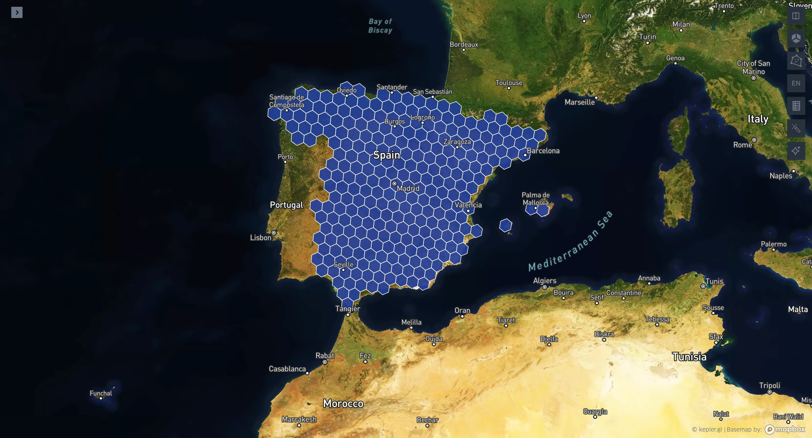

+++
title = 'geoterminal is out!'
date = 2025-04-10T00:25:52-04:00
+++


After spending some time working with GIS files on a daily basis, I realized there’s no comfortable and practical tool for quickly inspecting or transforming files with georeferenced vector data. Having to write three lines of code in a script or in the Python interpreter every time I want to transform geometries feels like a lot, and the sluggishness of desktop applications like ArcGIS and QGIS has always felt like a waste of my life—the cooling fans on my computer say it’s a waste of its life too.

GDAL and OGR have always been the go-to tools for working on the command line, but their power and flexibility for handling both vector and raster data come at the cost of a steep learning curve that can be tough for new users. I enjoy working in the terminal, and since I never really found an intuitive, easy-to-use application, I decided to build my own to simplify the day-to-day tasks a GIS developer has to deal with—the ones that don’t call for designing and building a full-blown system.

This post is here to show how geoterminal’s capabilities can make a GIS developer’s life a whole lot easier.

## geoterminal

geoterminal is a command-line interface tool to quickly inspect and transform geospatial data, letting users write less code and skip heavy software for quick operations.

Check out the [GitHub Repository](https://github.com/jeronimoluza/geoterminal), and follow along this walkthrough to learn how to use it!

## Walkthrough

### Getting Started

Install it with `pip`, or check the [Installation Guide](https://jeronimoluza.github.io/geoterminal/installation/) for other options:

```bash
pip install geoterminal
```

Let’s start by creating a folder for this demo and downloading the shapefiles of the world’s countries, published by the World Bank:

```bash
# Create folder
mkdir geoterminal_demo
cd geoterminal_demo

# Download World Bank's shapefile zip
curl --output countries.zip https://datacatalogfiles.worldbank.org/ddh-published/0038272/3/DR0046659/wb_countries_admin0_10m.zip

# Unzip the file
# tar -xf countries.zip will do if you are using Windows
unzip countries.zip
```

Checking the contents of the `WB_countries_Admin0_10m` folder, we should see something like this:


```console
❯ ls WB_countries_Admin0_10m
WB_countries_Admin0_10m.cpg
WB_countries_Admin0_10m.dbf
WB_countries_Admin0_10m.prj
WB_countries_Admin0_10m.sbn
WB_countries_Admin0_10m.sbx
WB_countries_Admin0_10m.shp
WB_countries_Admin0_10m.shp.xml
WB_countries_Admin0_10m.shx
```

### File Inspection

Just by running `geoterminal INPUT`, we enter inspect mode, where we get options to quickly look into georeferenced files. `geoterminal INPUT --head` shows us the first 5 rows of data (`--head N` for *N* rows), and we can see the last rows using the `--tail` flag.

```console
❯ geoterminal WB_countries_Admin0_10m/WB_countries_Admin0_10m.shp --head
Reading file with format: .shp
Getting first 5 rows
   OBJECTID       featurecla  LEVEL               TYPE                       FORMAL_EN FORMAL_FR  ...    WB_NAME  WB_RULES  WB_REGION  Shape_Leng  Shape_Area           geometry
0         1  Admin-0 country      2  Sovereign country           Republic of Indonesia      None  ...  Indonesia      None        EAP  495.029918  153.078608  MULTIPOLYGON(...)
1         2  Admin-0 country      2  Sovereign country                        Malaysia      None  ...   Malaysia      None        EAP   68.456913   26.703172  MULTIPOLYGON(...)
2         3  Admin-0 country      2  Sovereign country               Republic of Chile      None  ...      Chile      None        LCR  416.997272   76.761813  MULTIPOLYGON(...)
3         4  Admin-0 country      2  Sovereign country  Plurinational State of Bolivia      None  ...    Bolivia      None        LCR   54.345991   92.203587       POLYGON(...)
4         5  Admin-0 country      2  Sovereign country                Republic of Peru      None  ...       Peru      None        LCR   73.262192  106.417089  MULTIPOLYGON(...)

[5 rows x 53 columns]
```

We can get the coordinate reference system (CRS) of the files (if it's present) with the `--crs` flag, and we can check the column data types with the `--dtypes` flag, just like in pandas.

```console
❯ geoterminal WB_countries_Admin0_10m/WB_countries_Admin0_10m.shp --dtypes
Reading file with format: .shp
Getting data types information
Column data types:
  OBJECTID: int64
  featurecla: object
  LEVEL: int32
  TYPE: object
  FORMAL_EN: object
  FORMAL_FR: object
  ...

❯ geoterminal WB_countries_Admin0_10m/WB_countries_Admin0_10m.shp --crs
Reading file with format: .shp
Getting CRS information
CRS: EPSG:4326
```

### File Conversion

By default, geoterminal's will convert files between formats: `geoterminal input.shp output.geojson`.

```bash
geoterminal WB_countries_Admin0_10m/WB_countries_Admin0_10m.shp countries.geojson
```

This feature comes in handy when you want to work with other tools that require specific file formats, like kepler.gl. [kepler.gl](https://kepler.gl/demo) is a great web-based app for quickly uploading and visualizing GIS data. While it doesn't support shapefiles, we can upload our freshly converted `countries.geojson` and see our results in action.


Sweet!

geoterminal accepts geometries in Well-Known Text (WKT) format as input—essentially, geometries represented as a string, like this:

```text
POLYGON((-4.32 51.96, 20.29 51.96, 20.29 41.46, -4.32 41.46, -4.32 51.96))
```

This represents a bounding box around Europe that I just created using a tool called [BoundingBox](https://boundingbox.klokantech.com/).

I can take that string and use geoterminal to convert it into a GeoJSON file:

```bash
geoterminal "POLYGON((-4.32 51.96, 20.29 51.96, 20.29 41.46, -4.32 41.46, -4.32 51.96))" bounding_box.geojson
```


Let's keep going!

### Transformations

geoterminal really shines when we need to perform operations on the fly. The tool supports a variety of geometric operations, such as intersections, clips, buffers, simplifications, centroid calculations, and more. And it even includes H3 hexagon tessellation!

For example, let's buffer a point in the middle of the Gulf of Guinea:

```bash
geoterminal "POINT(0 0)" buffered_point.geojson --buffer-size 100000
```


For a more practical use case, let’s take the `countries.geojson` file and apply the `--intersects` flag with the newly created `bounding_box.geojson`. This will generate a new file containing only the countries that intersect with our bounding box, like this:

```bash
geoterminal countries.geojson intersected.geojson --intersects bounding_box.geojson
```


We can also perform a clip operation using the `--mask` flag, which will remove parts of the countries' geometries that fall outside the bounding box:

```bash
geoterminal countries.geojson masked.geojson --mask bounding_box.geojson
```


The `--intersects` and `--mask` arguments can also accept WKTs, meaning we can directly perform these operations without needing to convert the bounding box WKT into a file:

```bash
geoterminal countries.geojson intersected.geojson --intersects "POLYGON((-4.32 51.96, 20.29 51.96, 20.29 41.46, -4.32 41.46, -4.32 51.96))"
geoterminal countries.geojson masked.geojson --mask "POLYGON((-4.32 51.96, 20.29 51.96, 20.29 41.46, -4.32 41.46, -4.32 51.96))"
```

Here are a few more commands you can try to explore the various geoterminal operations:

```bash
geoterminal countries.geojson filtered.geojson --query "SUBREGION=='South America"
geoterminal countries.geojson centroids.geojson --centroid
geoterminal masked.geojson buffered.geojson --buffer-size 1000000
```

Check the [documentation](https://jeronimoluza.github.io/geoterminal/) for all the supported operations.

Now to the real thing:

### Chaining Operations

geoterminal’s most powerful feature is its ability to chain operations. All flags (`--command`) are executed sequentially while transforming the `INPUT` into the `OUTPUT`.

For example, let’s say I want to filter Spain from our data and transform the country’s geometry into H3 hexagons at resolution 4. I can easily do this in geoterminal using the `--query` command, followed by the `--h3-res` command, like this:

```bash
geoterminal countries.geojson spain_h4.geojson --query "WB_NAME=='Spain'" --h3-res 4
```



Now, let’s filter all the countries in the African continent, calculate the centroid of each country, and then apply a 100-kilometer buffer:

```bash
geoterminal countries.geojson african_100km_buffers.geojson --query "SUBREGION=='Africa'" --centroid --buffer-size 100000
```


Final example! Let’s filter Germany, Italy, Switzerland, and Austria, generate a mesh of H3 hexagons at resolution 4, calculate the centroids of those hexagons, and apply a 10-kilometer buffer:

```bash
geoterminal countries.geojson long_chain.geojson --query "WB_NAME in ('Germany', 'Italy', 'Switzerland', 'Austria')" --h3-res 4 --centroid --buffer-size 10000
```


### Conclusion

Thanks for reading! geoterminal is a work in progress, and like most open-source projects, it thrives on community input. It’s still under [active development](https://github.com/jeronimoluza/geoterminal), so if you have ideas, use cases, or want to help push the project forward—jump in!
