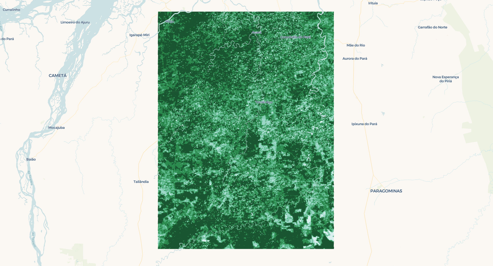

+++
title = 'Processing MODIS NDVI Data in Python: Transforming Multidimensional Arrays to Polygons'
date = 2025-02-15T16:25:52-04:00
math = true
+++

A few weeks ago, I had the opportunity to work with NASA's MODIS NDVI data. Utilizing an [example script](http://hdfeos.org/zoo/LPDAAC/MOD09GA.A2007268.h10v08.061.2021074090204.hdf.py) from the [HDF - EOS Tools and Information Center](http://hdfeos.org/zoo/) as reference, I developed a program that takes an area of interest, a start date, and an end date, then downloads and processes the corresponding NDVI data from NASA archives. The program leverages parallel processing to efficiently convert NDVI raster data into vectorized polygons. In this blog post, I'll share my approach and insights from the process.


The **Normalized Difference Vegetation Index (NDVI)** is a widely used remote sensing index that measures vegetation health and density. It is based on the difference in reflectance between the near-infrared (NIR) and red (RED) wavelengths, as healthy vegetation strongly reflects NIR light while absorbing RED light. NDVI is calculated using the following equation:  

$$
NDVI = \frac{NIR - RED}{NIR + RED}
$$  

where:  
- $NIR$ = reflectance in the near-infrared band  
- $RED$ = reflectance in the red band  

Values range from -1 to 1, where higher values indicate healthier vegetation.  

The key dataset providing NDVI measurements is the **MODIS 16-day NDVI 250m product** ([MOD13Q1](https://lpdaac.usgs.gov/products/myd13q1v061/) for Terra and [MYD13Q1](https://lpdaac.usgs.gov/products/mod13q1v061/) for Aqua). This product offers global vegetation index data at a **250-meter spatial resolution**, composited over a **16-day period** to minimize cloud contamination and atmospheric noise. Derived from the **Moderate Resolution Imaging Spectroradiometer (MODIS)** sensor aboard NASA's Terra and Aqua satellites, it ensures high-quality data by selecting the best available pixel based on cloud cover, aerosol levels, and sensor viewing geometry. MOD13Q1 and MYD13Q1 are widely used in ecological monitoring, agriculture, and climate studies, supporting applications such as drought assessment, land cover classification, and vegetation phenology analysis.

## The Downloading

To download the NDVI data from the NASA archives, the program uses the [`earthaccess`](https://github.com/nsidc/earthaccess) library. `earthaccess` is a Python library to search for, and download or stream NASA Earth science data with just a few lines of code. The only requirement to use this library is to open a free account with NASA [Earthdata Login](https://urs.earthdata.nasa.gov/).

By default, `earthaccess` will look for your Earthdata Login credentials in a `.netrc` file, or in environment variables `EARTHDATA_USERNAME` and `EARTHDATA_PASSWORD`. If you don't have either of these set up, you can login manually. See the [Authenticating guide](https://earthaccess.readthedocs.io/en/latest/howto/authenticate/) to learn how to create a `.netrc` file or environment variables.

```python
import earthaccess

earthaccess.login()
```
Read more about `earthaccess` on the [library's documentation](https://earthaccess.readthedocs.io/en/latest/).

The program includes a function that facilitates the interaction with the `earthaccess` module. The `earthaccess.search()` function requires a product’s short name, version, a bounding box in `(lower_left_lon, lower_left_lat, upper_right_lon, upper_right_lat)` format, a `(start_date, end_date)` tuple, and an optional `count` parameter to limit results.  

For a more flexible input handling, I created a `get_bounding_box()` function that processes the area of interest and generates a bounding box in the required format. This function supports various input types, including `shapely.geometry.Polygon`, `shapely.geometry.MultiPolygon`, `geopandas.GeoDataFrame`, and Well-Known Text (WKT).

```python
import geopandas as gpd
from shapely import wkt
from shapely.geometry import MultiPolygon, Polygon

def get_bounding_box(region):
    if isinstance(region, (Polygon, MultiPolygon)):
        (
            minx,
            miny,
            maxx,
            maxy,
        ) = region.bounds  # Directly get bounds for shapely geometries

    elif isinstance(region, gpd.GeoDataFrame):
        (
            minx,
            miny,
            maxx,
            maxy,
        ) = region.total_bounds  # Get total bounds for GeoDataFrame

    elif isinstance(region, str):
        try:
            geom = wkt.loads(region)  # Load WKT string
            if isinstance(geom, (Polygon, MultiPolygon)):
                minx, miny, maxx, maxy = geom.bounds
            else:
                raise ValueError(
                    "WKT does not represent a valid Polygon or MultiPolygon."
                )
        except Exception as e:
            raise ValueError(f"Invalid WKT string: {e}")

    else:
        raise TypeError(
            "Unsupported region type. Must be a Polygon, MultiPolygon, GeoDataFrame, or WKT string."
        )

    return (
        minx,
        miny,
        maxx,
        maxy,
    )
```

The following function automates the download of NASA granules for a specified product, given a time range and region of interest. It leverages the `earthaccess` library to search and download granules while organizing the output into a structured folder.

```python
import earthaccess
import os

def download_earthaccess(
    download_dir: str,
    short_name: str,
    version: str,
    start_date: str,
    end_date: str,
    region,
    count: int = 10,
) -> list:
    bounding_box = get_bounding_box(region=region)

    download_dir = download_dir + f"/{short_name}_{version}"
    # Define download directory
    os.makedirs(download_dir, exist_ok=True)

    # Search for NASA granules
    granules = earthaccess.search_data(
        short_name=short_name,
        version=version,
        temporal=(start_date, end_date),
        bounding_box=bounding_box,
        count=count,
    )

    print(f"Found {len(granules)} granules.")
    print(f"Downloading {count} granules.")

    # Download granules
    files = earthaccess.download(granules, local_path=download_dir)

    print(f"Downloaded {len(files)} files to {download_dir}.")
    return files
```

## The Processing

To illustrate the processing of the downloaded files, I'll first present the high-level function that handles a single file before breaking down its components. The workflow begins by extracting metadata from the `hdf` file upon opening. Next, it processes the `numpy` data array by replacing fill values and out-of-range values with `np.nan`, then applies the scale factor to transform the data. Finally, it generates pixel polygon data using the scene's corner coordinates and converts the results into a `geopandas.GeoDataFrame` with the standard CRS (`EPSG:4326`).

```python
from shapely.geometry import Polygon
import geopandas as gpd
from pyhdf.SD import SD, SDC

def process_file(
    filepath: str, data_field: str, geometry: Polygon = None
) -> gpd.GeoDataFrame:
    print(f"Processing file: {filepath}")
    hdf_file = SD(filepath, SDC.READ)
    print("Extracting from HDF...")
    (
        _FillValue,
        scale_factor,
        valid_range,
        add_offset,
        upper_left_x,
        upper_left_y,
        lower_right_x,
        lower_right_y,
    ) = extract_metadata(hdf_file, data_field)
    data = hdf_file.select(data_field)
    data = treat_data_array(data, _FillValue, scale_factor, valid_range, add_offset)
    hdf_file.end()
    print("Done!")

    polygons, values = generate_polygon_data(
        data, upper_left_x, upper_left_y, lower_right_x, lower_right_y, n_jobs=-1
    )
    return create_geodataframe_and_reproject(polygons, values, data_field, geometry)
```

### Extracting Raw Files Metadata

The `extract_metadata()` function is designed to retrieve metadata from an HDF file for a specific data field. It begins by accessing the global attributes of the HDF object, specifically the `StructMetadata.0` attribute, which contains information about the dataset’s spatial structure. This metadata provides details about the dataset's bounding box and coordinate system.

Next, the function extracts attributes specific to the requested data field, retrieving values such as the fill value, scale factor, valid range, and offset. These attributes help in ensuring that missing values are accounted for, and that numerical values can be properly scaled and adjusted.

To determine the spatial extents of the dataset, the function then parses the global metadata using regular expressions. It searches for coordinate values defining the upper-left and lower-right corners of the grid, extracting these as floating-point numbers.

Finally, the function returns a tuple containing all the extracted information, including the fill value, scale factor, valid range, offset, and the four coordinate values that define the dataset’s spatial boundaries.

```python
from pyhdf.SD import SD
import re
import numpy as np

def extract_metadata(hdf_object: SD, data_field: str) -> tuple:

    struct_metadata = hdf_object.attributes(full=1)["StructMetadata.0"][0]
    data_field_metadata = hdf_object.select(data_field).attributes(full=1)
    lna = data_field_metadata["long_name"][0]
    valid_range = data_field_metadata["valid_range"][0]
    _FillValue = data_field_metadata["_FillValue"][0]
    scale_factor = data_field_metadata["scale_factor"][0]
    units = data_field_metadata["units"][0]
    add_offset = data_field_metadata["add_offset"][0]

    ul_regex = re.compile(
        r"""UpperLeftPointMtrs=\(
                              (?P<upper_left_x>[+-]?\d+\.\d+)
                              ,
                              (?P<upper_left_y>[+-]?\d+\.\d+)
                              \)""",
        re.VERBOSE,
    )

    match = ul_regex.search(struct_metadata)
    upper_left_x = np.float64(match.group("upper_left_x"))
    upper_left_y = np.float64(match.group("upper_left_y"))

    lr_regex = re.compile(
        r"""LowerRightMtrs=\(
                              (?P<lower_right_x>[+-]?\d+\.\d+)
                              ,
                              (?P<lower_right_y>[+-]?\d+\.\d+)
                              \)""",
        re.VERBOSE,
    )
    match = lr_regex.search(struct_metadata)
    lower_right_x = np.float64(match.group("lower_right_x"))
    lower_right_y = np.float64(match.group("lower_right_y"))

    return (
        _FillValue,
        scale_factor,
        valid_range,
        add_offset,
        upper_left_x,
        upper_left_y,
        lower_right_x,
        lower_right_y,
    )
```
### Transforming the Data Array

The `treat_data_array()` function processes and cleans a numerical dataset by applying a series of transformations based on metadata attributes. It begins by ensuring that the input data, stored in a NumPy array, is converted to a floating-point format to facilitate precise calculations. 

Once the data is properly formatted, the function identifies and masks invalid values. It checks each element in the array against the provided valid range, marking any values that fall outside this range as invalid. Additionally, it looks for occurrences of the designated fill value, which represents missing or unusable data, and treats those as invalid as well. All such values are replaced with `NaN` to indicate their exclusion from further computations.

After handling invalid values, the function applies a transformation to adjust the numerical values according to the provided offset and scale factor. The offset is first subtracted from each value, and then the result is divided by the scale factor, effectively converting raw stored values into meaningful, scaled data.

To ensure that invalid data points are properly handled in subsequent operations, the function converts the processed array into a masked array, where all `NaN` values are explicitly marked as masked elements. Finally, the cleaned and transformed array is returned, ready for analysis or visualization with missing or out-of-range values properly excluded.

```python
import numpy as np

def treat_data_array(
    data_array: np.ndarray,
    _FillValue: int,
    scale_factor: float,
    valid_range: list,
    add_offset: float,
) -> np.ndarray:

    data_array = data_array.get().astype(np.float64)
    invalid = np.logical_or(data_array < valid_range[0], data_array > valid_range[1])
    invalid = np.logical_or(invalid, data_array == _FillValue)
    data_array[invalid] = np.nan
    data_array = (data_array - add_offset) / scale_factor
    data_array = np.ma.masked_array(data_array, np.isnan(data_array))
    return data_array

```

### Generating the Polygon Data

To transform a gridded dataset into a set of spatially-referenced polygons, we use two functions: `create_polygon()` and `generate_polygon_data()`. The `create_polygon()` function is a helper function that constructs individual polygons for each pixel, while `generate_polygon_data()` orchestrates the process by applying `create_polygon()` across an entire dataset in parallel. We will first explore the `create_polygon()` function before moving on to `generate_polygon_data()`. 

```python
import numpy as np
from shapely.geometry import Polygon

def create_polygon(
    i: int,
    j: int,
    x_min: np.ndarray,
    x_max: np.ndarray,
    y_min: np.ndarray,
    y_max: np.ndarray,
) -> Polygon:
    return Polygon(
        [
            (x_min[j], y_min[i]),  # Lower-left
            (x_max[j], y_min[i]),  # Lower-right
            (x_max[j], y_max[i]),  # Upper-right
            (x_min[j], y_max[i]),  # Upper-left
            (x_min[j], y_min[i]),  # Close polygon
        ]
    )
```

The `create_polygon()` function constructs a bounding box polygon around a specific pixel in a gridded dataset. Given the row and column indices of the pixel, along with arrays that store the minimum and maximum x and y coordinates for the grid, the function determines the four corners of the pixel’s bounding box. It then uses these coordinates to create a closed polygon by connecting the lower-left, lower-right, upper-right, and upper-left corners before returning to the starting point. The result is a `shapely.geometry.Polygon` object that precisely outlines the area occupied by the pixel.

With this helper function in place, we can now define `generate_polygon_data()`, which applies `create_polygon()` across an entire dataset to produce a collection of polygons representing the grid.

The `generate_polygon_data()` function is responsible for transforming an entire 2D gridded dataset into a set of spatially-referenced polygons, each corresponding to a pixel in the grid. It begins by defining the spatial extent of the grid using the provided upper-left and lower-right coordinates. It then calculates a set of evenly spaced x and y coordinates that define the grid’s structure. Using these coordinates, the function computes the width and height of each pixel, which are used to determine the bounding box for each grid cell.

With the grid structure established, the function generates a list of index pairs representing each pixel's position in the dataset. It then leverages parallel processing to efficiently convert each pixel into a polygon by calling the `create_polygon()` function for every index pair. 

```python
from joblib import Parallel, delayed
import numpy as np

def generate_polygon_data(
    data: np.ndarray,
    upper_left_x: float,
    upper_left_y: float,
    lower_right_x: float,
    lower_right_y: float,
    n_jobs: int = -1,
) -> tuple:

    print("Polygonizing data...")

    ny, nx = data.shape

    # Generate vectorized grid coordinates
    x = np.linspace(upper_left_x, lower_right_x, nx)
    y = np.linspace(upper_left_y, lower_right_y, ny)

    # Compute pixel size
    pixel_width = (lower_right_x - upper_left_x) / nx
    pixel_height = (lower_right_y - upper_left_y) / ny

    # Compute lower-left and upper-right corners
    x_min = x[:-1]  # Shape (nx-1,)
    y_min = y[:-1]  # Shape (ny-1,)
    x_max = x_min + pixel_width
    y_max = y_min + pixel_height

    # Generate all (i, j) index pairs
    index_pairs = [(i, j) for i in range(nx - 1) for j in range(ny - 1)]

    # Parallelized polygon creation
    polygons = Parallel(n_jobs=n_jobs)(
        delayed(create_polygon)(i, j, x_min, x_max, y_min, y_max)
        for i, j in tqdm(index_pairs, total=len(index_pairs))
    )

    # Flatten the data array to match polygons
    values = data[:-1, :-1].ravel()
    print("Done!")

    return polygons, values
```

### Generating the GeoDataFrame and Reprojecting the Data

The `create_geodataframe_and_reproject()` function takes a set of spatially-referenced polygons and their corresponding data values and converts them into a `GeoDataFrame`. It first assigns the polygons and values to a `GeoDataFrame` using a coordinate reference system (CRS) based on the Sinusoidal projection, which is the projection in which the MODIS data is in. Once the `GeoDataFrame` is created, the function reprojects the data into WGS84 (`EPSG:4326`).  

```python
def create_geodataframe_and_reproject(
    polygons: list, values: list, data_field: str, polygon_to_check: bool = None
) -> pd.DataFrame:
    print("Creating GeoDataFrame and reprojecting...")
    sinu_proj = "+proj=sinu +R=6371007.181 +nadgrids=@null +wktext"
    gdf = gpd.GeoDataFrame({data_field: values, "geometry": polygons}, crs=sinu_proj)
    # Reproject from Sinusoidal to WGS84
    gdf = gdf.to_crs("EPSG:4326")
    if polygon_to_check:
        gdf = gdf[gdf.geometry.intersects(polygon_to_check)]

    # Convert to WKT
    gdf["wkt"] = gdf["geometry"].apply(lambda geom: geom.wkt)
    print("Done!")

    return gdf[[data_field, "wkt"]]
```

If a filtering polygon is provided, the function checks which polygons intersect with it and retains only those, effectively reducing the dataset to a specific area of interest. Finally, it converts the geometries to Well-Known Text (WKT) format, making it easier to store or process further. The resulting `GeoDataFrame` contains two columns: one for the data values and another for the WKT representation of each polygon.


### Running the Script

We're almost at the end! To run the script over a region, you can use your own WKT, a `Polygon`, a `MultiPolygon`, or a `GeoDataFrame`. Here's a short snippet to do so using a WKT over Tomé Açu, Pará, Brazil:

```python
if __name__ == "__main__":
    download_dir = "./data"

    # Define search parameters
    short_name = "MOD13Q1"
    version = "061"  # Latest version of MOD13Q1
    start_date = "2020-01-01"
    end_date = "2020-12-31"
    count = 1

    data_field = "250m 16 days NDVI"

    # Tomé Açu, Pará, Brazil
    region = wkt.loads(
        "POLYGON((-48.837 -1.83, -47.6921 -1.83, -47.6921 -3.3766, -48.837 -3.3766, -48.837 -1.83))"
    )

    files = download_earthaccess(
        download_dir=download_dir,
        short_name=short_name,
        version=version,
        start_date=start_date,
        end_date=end_date,
        region=region,
        count=count,
    )
    single_file = files[0]
    result = process_file(filepath=single_file, data_field=data_field, geometry=region)
    result.to_csv("output.csv", index=None)
```
The result is a vector representation of the pixel data in `hdf` format.

```
|    |   ndvi | wkt                                                                                                                                                                                                              | date       |
|---:|-------:|:-----------------------------------------------------------------------------------------------------------------------------------------------------------------------------------------------------------------|:-----------|
|  0 | 0.8683 | POLYGON ((-48.83714832414897 -1.829547822299263, -48.83506392825065 -1.829547822299263, -48.835120680657546 -1.8316311556324096, -48.8372050789782 -1.8316311556324096, -48.83714832414897 -1.829547822299263))  | 2020-09-13 |
|  1 | 0.8683 | POLYGON ((-48.835063493911015 -1.829547822299263, -48.8329790980127 -1.829547822299263, -48.83303584799677 -1.8316311556324096, -48.83512024631741 -1.8316311556324096, -48.835063493911015 -1.829547822299263)) | 2020-09-13 |
|  2 | 0.849  | POLYGON ((-48.83297866367305 -1.829547822299263, -48.830894267774745 -1.829547822299263, -48.83095101533598 -1.8316311556324096, -48.83303541365662 -1.8316311556324096, -48.83297866367305 -1.829547822299263)) | 2020-09-13 |
|  3 | 0.7986 | POLYGON ((-48.8308938334351 -1.829547822299263, -48.828809437536776 -1.829547822299263, -48.82886618267518 -1.8316311556324096, -48.83095058099583 -1.8316311556324096, -48.8308938334351 -1.829547822299263))   | 2020-09-13 |
|  4 | 0.7986 | POLYGON ((-48.82880900319715 -1.829547822299263, -48.826724607298836 -1.829547822299263, -48.82678135001441 -1.8316311556324096, -48.82886574833505 -1.8316311556324096, -48.82880900319715 -1.829547822299263)) | 2020-09-13 |
```

The next image shows the vectorized pixels over Tomé Açu, Pará, Brazil, visualized in [kepler.gl](kepler.gl/demo).



## Conclusion

That's it for this post! You can find all the code needed to replicate this in my [code samples repository](https://github.com/jeronimoluza/code_samples/Python/ndvi). It also includes scripts to run the routine for the same time window across different years and to download and process data for continuous time periods.
