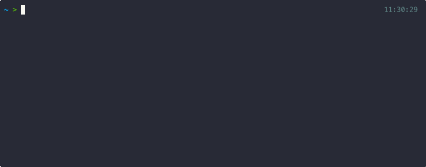

+++
title = "Run Large Language Models (LLMs) Locally with Ollama: Chat with the Models & Control Them using Python"
date = 2025-06-04T07:18:52-04:00
math = true
+++

Large language models are here to stay, and I thought it’d be a good idea to write a post about how to download one and run it locally on a personal computer. Of course, this same explanation applies if you're using a virtual machine in the cloud (AWS, GCP)—the key difference lies in hardware limitations and the size of the models you’re able to run. A personal computer will rarely match the capabilities of a cutting-edge virtual machine.



## Getting Started

To get started, we need to download and install **Ollama**, a lightweight, extensible framework for running language models locally. It provides a simple API for creating, running, and managing models, along with a library of pre-built models ready to use in a wide range of applications.

You can visit the [GitHub repository](https://github.com/ollama/ollama) to find installation instructions for your operating system. If you have Homebrew installed on your machine, you can install Ollama with the command:

```bash
brew install ollama
```


## Usage

### Chatting

Once Ollama is installed, we can use it through the graphical interface or the terminal. I prefer using the terminal, so let’s open one and run:

```bash
ollama serve
```

This starts the Ollama server, which lets us interact with the application—download models, open a chat session with the model of our choice, and more.

Next, open another terminal to download and chat with the `gemma3` model. For this example, we’ll install the 1-billion-parameter version, which is about 815MB, using the command:

```bash
ollama run gemma3:1b
```

This will start downloading the model and open a prompt where you can start chatting.


To see which models are currently installed on your system, use the following command:

```bash
ollama list
```

```
> ollama list
NAME         ID              SIZE      MODIFIED
gemma3:1b    8648f39daa8f    815 MB    8 minutes ago
```

### Sending Prompts Using Python

We can send prompts to our locally served LLM using Python in a very simple way. By default, the model is served at `http://localhost:11434/api/generate`, so we can use the `requests` library to send prompts to that endpoint.

The following snippet shows how to interact with the model using Python by looping through a list of countries and asking the model to tell us the capital of each one:

```python
# show.py

# This script sends prompts to a locally running Ollama model
# and prints the capital of each country in the list.

import requests
import time

OLLAMA_URL = "http://localhost:11434/api/generate"
MODEL = "gemma3:1b"  # Adjust MODEL if you're using a different model


def ask_ollama(prompt, model=MODEL):
    payload = {"model": model, "prompt": prompt, "stream": False}

    try:
        response = requests.post(OLLAMA_URL, json=payload)
        response.raise_for_status()
        result = response.json()
        return result.get("response", "").strip()
    except requests.exceptions.RequestException as e:
        return f"Error: {e}"


def main():
    countries = [
        "France",
        "Japan",
        "Brazil",
        "Kenya",
        "Canada",
        "India",
        "Australia",
        "Egypt",
    ]

    for country in countries:
        prompt = f"What is the capital of {country}?"
        print(prompt)
        answer = ask_ollama(prompt)
        print(f"{country}: {answer}")
        print("\n----------\n")
        time.sleep(1)


if __name__ == "__main__":
    main()
```


This way, we can programmatically use the model and build all kinds of applications—like summarizing news articles, doing natural language processing (NLP), and much more! The main limitations come from the model’s specifications, which in turn depend on the hardware of the machine you’re running it on.

To delete a model, simply run:

```bash
ollama rm gemma3:1b
```

```
> ollama rm gemma3:1b
deleted 'gemma3:1b'
```

## Wrapping Up

Running LLMs locally with Ollama opens up a lot of possibilities—whether you're experimenting, building a project, or just curious. It’s fast, flexible, and private. With a simple setup and a bit of Python, you're in full control.