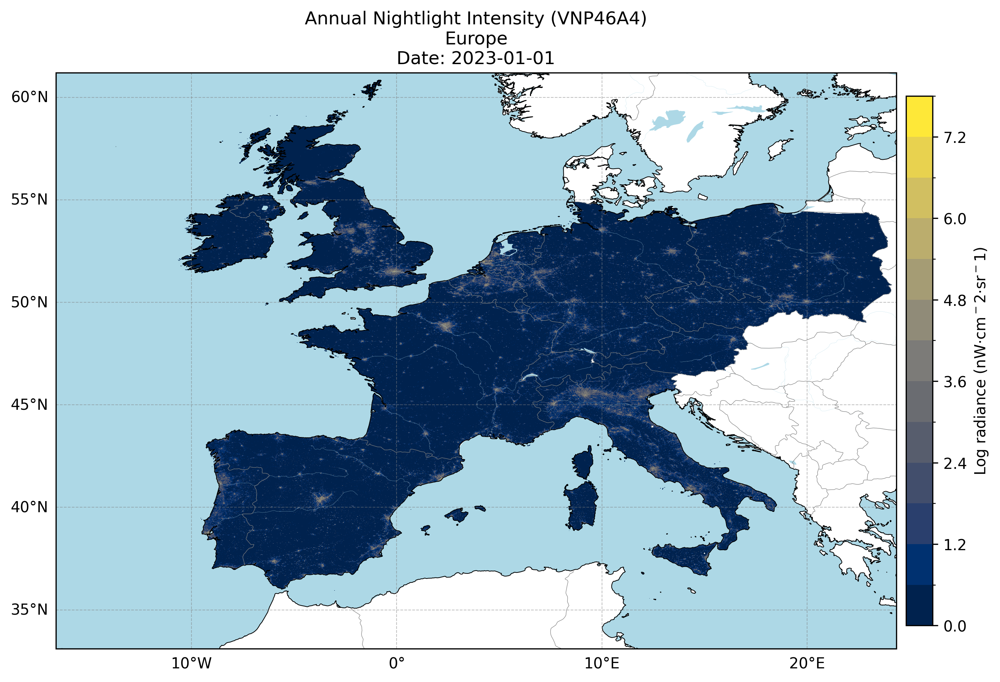
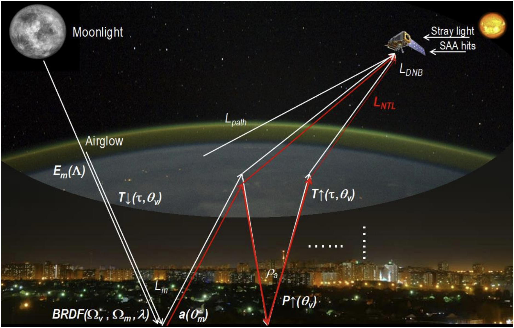
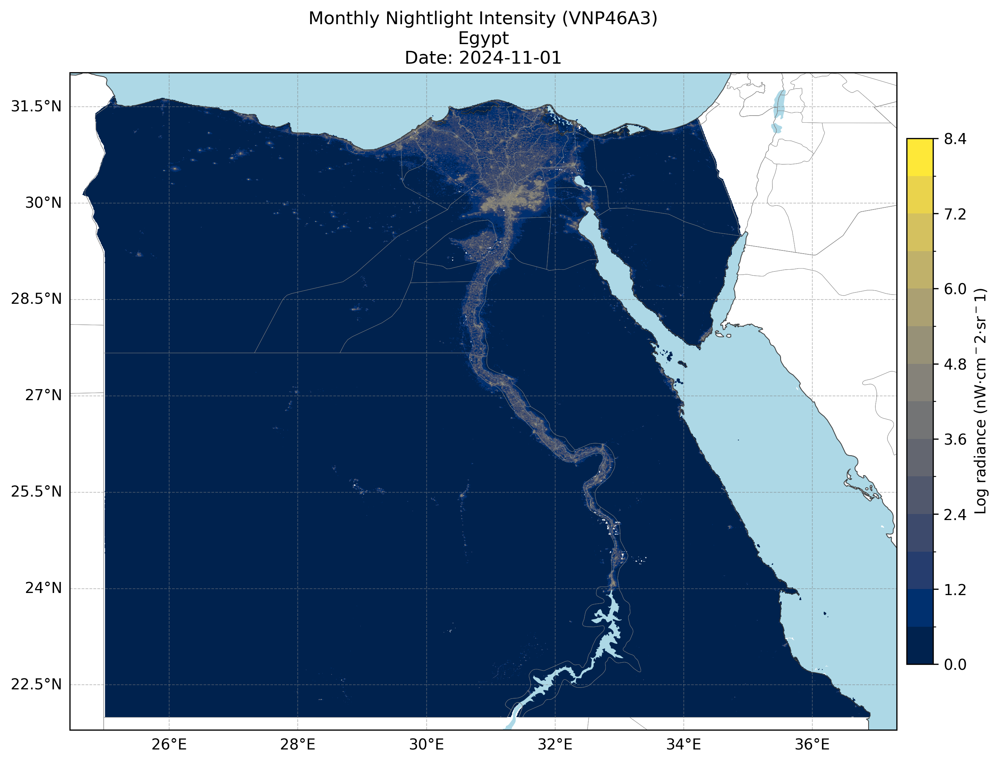
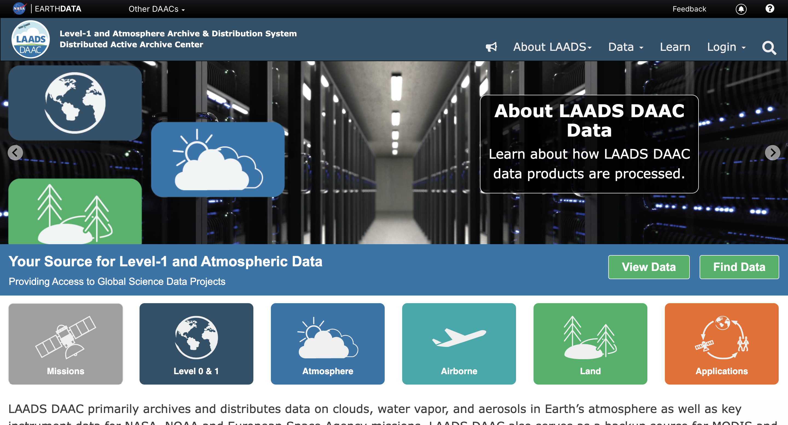
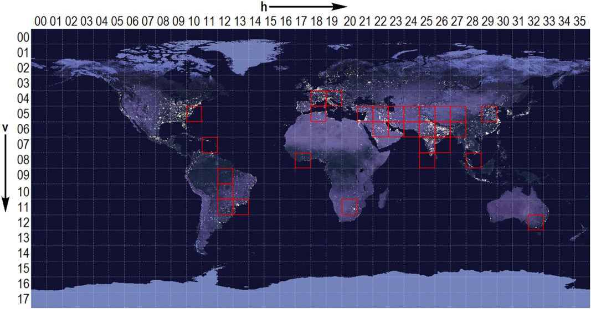

+++
title = "Visualize NASA's Black Marble Nightlights Suite"
date = 2025-05-15T07:18:52-04:00
math = true
+++

en este post voy a hablar de uno de los datasets mas famosos provistos por nasa. se trata de la black marble nightlights suite, un set de productos satelitales que permiten observar como se ven las remotely-sensed lights at night, con un sinfin de aplicaciones en materia de disaster response, economic activity proxying, energy infrastructure monitoring, and more.

Figure 1: Annual Nightlight Intensity Over Europe.

The NASA's Black Marble product suite provides insights into nighttime lights around the globe. Available from January 2012 until the present day and with a spatial resolution of 15 arc second (~500 meters), these products are derived from data collected by the Visible Infrared Imaging Radiometer Suite (VIIRS) Day/Night Band instrument on the Suomi National Polar-orbiting Partnership (NPP) satellite.

At the core of the Black Marble suite are two primary products: VNP46A1 and VNP46A2. VNP46A1 is a daily, top-of-atmosphere product that captures raw nighttime radiance data without any corrections applied. VNP46A2, on the other hand, is a daily moonlight- and atmosphere-corrected Nighttime Lights product. It undergoes various corrections including cloud removal, atmospheric correction lunar bidirectional reflectance distribution function (BRDF) adjustment, and snow/vegetation effects mitigation.

Figure 2: NASA's Black Marble retrieval strategy combines daytime surface reflectance, BRDF, surface albedo, Nadir BRDF-Adjusted Reflectance and Lunar irradiance values to minimize the biases caused by extraneous artifacts.

The VNP46A3 and VNP46A4 products are generated from the VNP46A2 daily VIIRS Day/Night Band (DNB) radiance data by compositing high-quality, cloud-free nighttime observations. A key step in this process is the application of a boxplot-based correction that uses the interquartile range (IQR) to identify and remove outliers. Specifically, observations falling outside the range defined by Q1 − 1.5×IQR and Q3 + 1.5×IQR are considered anomalous and excluded, effectively filtering out spurious light sources such as fires, lightning, or flaring. The cleaned data is then aggregated to produce stable monthly (VNP46A3) and annual (VNP46A4) composites that better represent persistent nighttime lights. 

For more information, check out the [Black Marble User Guide](https://ladsweb.modaps.eosdis.nasa.gov/api/v2/content/archives/Document%20Archive/Science%20Data%20Product%20Documentation/Black-Marble_v2.0_UG_2024.pdf).

Figure 3: Monthly Nightlight Intensity Over Egypt

The [LAADS DAAC (Level 1 Atmospheric Archive Distribution System)](https://ladsweb.modaps.eosdis.nasa.gov/) is a resource for accessing NASA's satellite data, including the Black Marble products. This archive serves as a primary distribution center for Level 1 geophysical data products from various NASA satellites, offering researchers and analysts easy access to remote sensing datasets. To begin accessing Black Marble products through LAADS DAAC, users first need to create an [Earthdata Login account](https://urs.earthdata.nasa.gov/).

Figure 4: LAADS DAAC data portal allows users to download collections of NASA's remote sensing products.

Once logged in, users can navigate to the Nighttime Lights product page on the LAADS DAAC website. From there, they can select the appropriate Black Marble product – VNP46A1, VNP46A2, VNP46A3, or VNP46A4 – depending on their specific needs. The LAADS DAAC NASA archive offers several download scripts to help users efficiently access and retrieve satellite data products like those from the Black Marble series, providing automated solutions for downloading large amounts of data available through the archive using [wget, Python, Perl, and Bash](https://ladsweb.modaps.eosdis.nasa.gov/tools-and-services/data-download-scripts).

The Black Marble project employs a globe tile gridding system to efficiently distribute and access its satellite data products. This system divides the Earth's surface into a grid of square tiles, each covering approximately 10 degrees of latitude by 10 degrees of longitude. Each tile contains a portion of the Black Marble imagery, enabling users to request specific regions of interest without having to download entire datasets.

Figure 5: The Suomi-NPP VIIRS linear latitude/longitude (or geographic) grid consists of 460 non-overlapping Land tiles, which measure approximately 10°×10° region.

The extraction of pixel boundaries from each file involves a calculation of geographical coordinates based on the Black Marble tile's limits and file matrix dimensions. The process begins by determining the size of each tile in degrees using its west, north, east, and south bounds. Then, utilizing the matrix dimensions (rows and columns), the distances between pixel boundaries are calculated. Specifically, the distance from the west-east bounds of the tile is divided by the number of rows (X) to determine the longitude increment per pixel, while the distance from the north-south bounds is divided by the number of columns (Y) to calculate the latitude increment per pixel.

The Black Marble suite has been used in various applications, including tracking shipping and fishing vessels (Sarangy & Nagendra Jaiganesh, 2021), assessing conflict-associated changes (Li et al., 2018), and mapping economic development patterns. These products have also been instrumental in disaster response efforts, such as monitoring power outages during hurricanes and tracking recovery efforts post-disaster (Zhao et al., 2020).